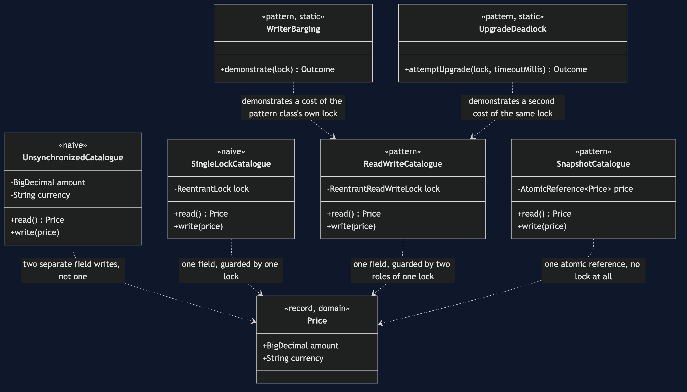
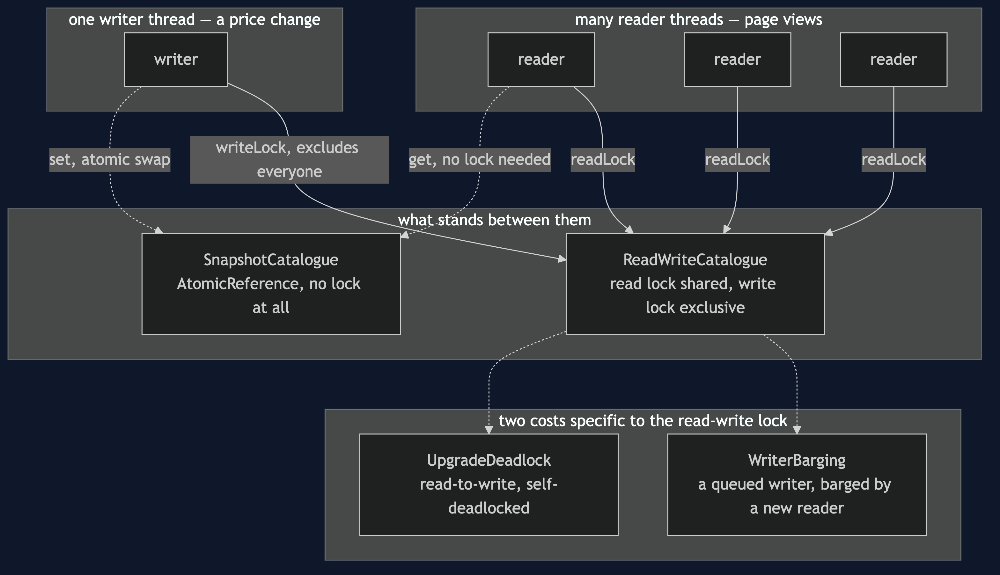
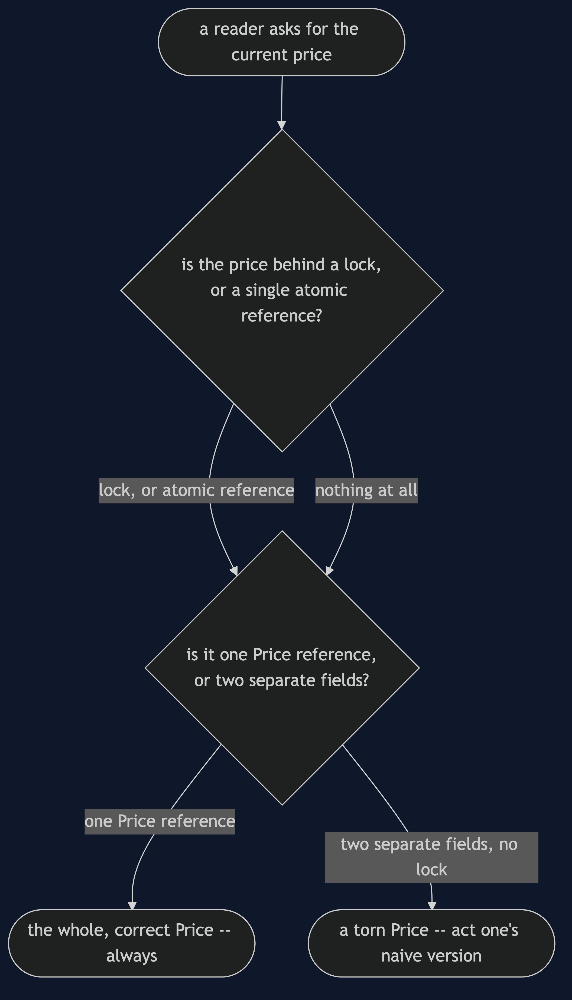
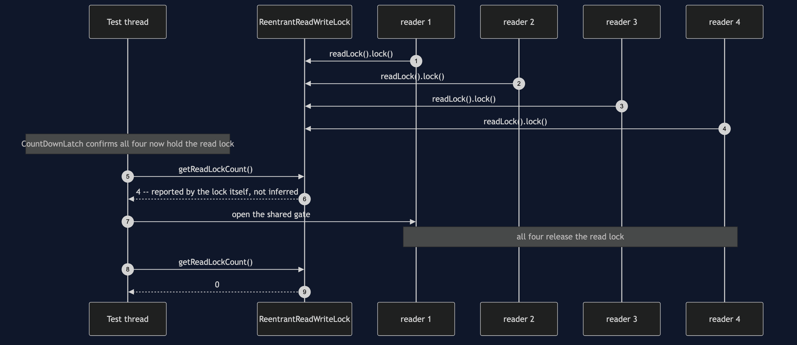
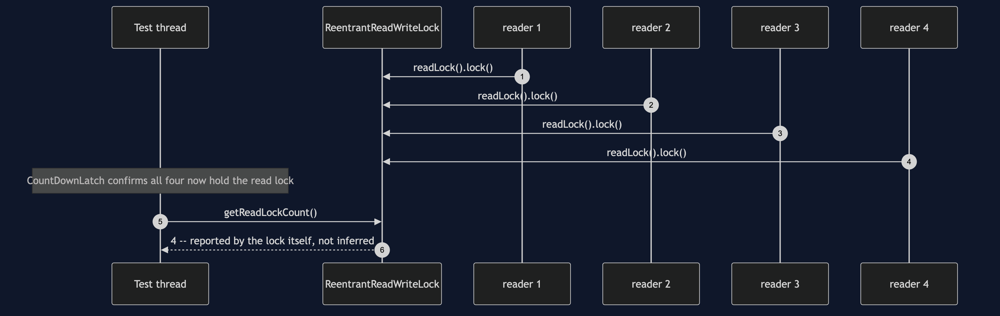
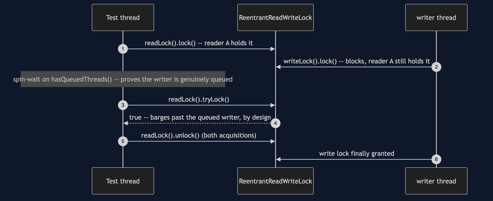
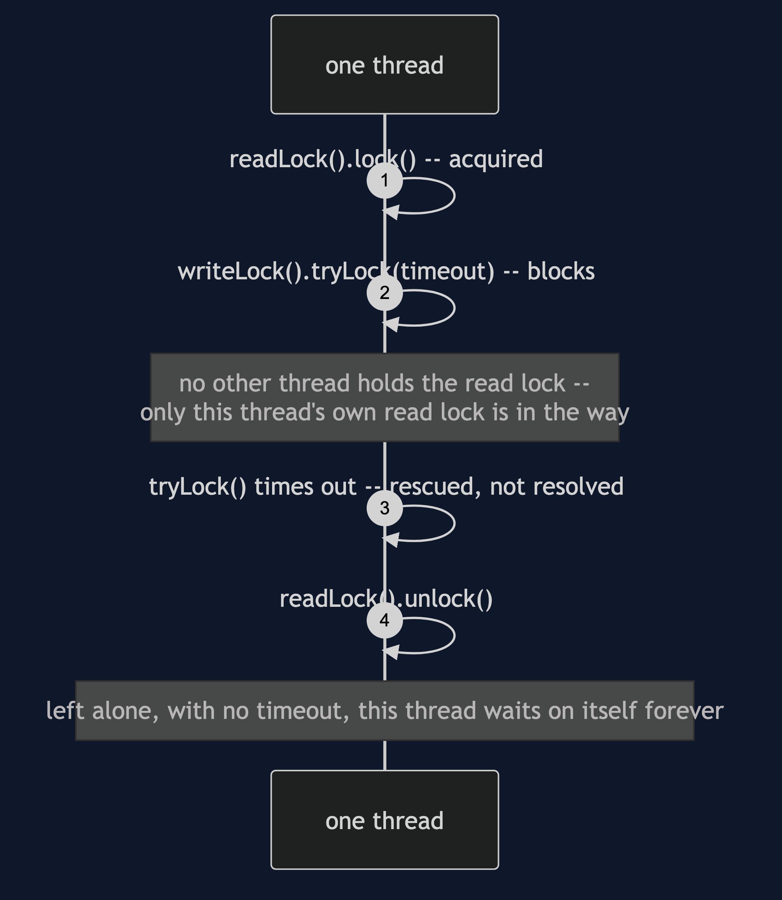

# Read–Write Lock Pattern

```
src/main/java/com/jk/explore/readwritelock/
├── CatalogueDemo.java                composition root — the six acts
│
├── domain/
│   └── Price.java                     record(amount, currency) — two fields, so it can tear
├── harness/                          ← reused unchanged from §46
│   ├── Gate.java
│   ├── Rendezvous.java
│   └── StepExecutor.java
├── naive/
│   ├── UnsynchronizedCatalogue.java   no lock — the torn read
│   └── SingleLockCatalogue.java       one mutex — correct, readers queue
│
└── pattern/                          ← the real thing
    ├── ReadWriteCatalogue.java        shared read lock, exclusive write lock
    ├── WriterBarging.java             a queued writer, overtaken
    ├── UpgradeDeadlock.java           read lock to write lock waits on itself
    └── SnapshotCatalogue.java         the honest alternative: no lock at all
```

**Many readers may hold the lock together, but a writer holds it alone,
because two reads can never conflict with each other and only a write can
conflict with anything.**

This is the fourth project in
[concurrency-design-patterns](..), reusing
[Producer–Consumer](../producer-consumer-pattern)'s harness directly. The
first three projects move work around; this one protects the shared data
that work reads from: a product's price, read by a thousand shoppers and
changed now and then by a merchandiser.

## Run

```bash
./gradlew run
```

Six acts. The timings in acts two, three and six are real measurements and
change from run to run and machine to machine; the ordering between them,
and every other line, is what the tests pin.

Act one is a price read with no lock at all.

```
ONE. No lock at all — the torn read.
  read mid-update: 54.99 GBP
  never a true price: the new amount with the old currency.
```

Act two is one plain lock around everything: correct, but readers queue.

```
TWO. One mutual-exclusion lock — correct, but readers queue too.
  8 readers x 50,000 reads each: 15ms
  every reader queued behind every other reader -- two readers
  can never conflict, and this lock cannot tell them apart.
```

Act three is the pattern, and a surprise.

```
THREE. The pattern — many readers together, a writer alone.
  8 readers x 50,000 reads each: 138ms
  no reader ever waited on another reader -- and for a read this
  cheap, that freedom costs more than it saves. See act six.
```

Act four shows a queued writer being overtaken.

```
FOUR. The mechanism behind writer starvation.
  writer genuinely queued, waiting: true
  a second reader's tryLock() barged past it anyway: true
  documented behaviour, not a fluke -- do this continuously and a
  writer can wait far longer than its own work would ever justify.
```

Act five shows why a read lock can never be upgraded.

```
FIVE. Upgrading a read lock to a write lock deadlocks.
  same thread, holding the read lock, requests the write lock:
  deadlocked: true, rescued after 203ms by a demonstration timeout
  left alone, this thread waits on itself forever.
```

Act six puts the lock next to its rivals.

```
SIX. When the lock loses.
  single mutex:      16ms
  read-write lock:    137ms
  immutable snapshot: 2ms
  the lock advertised for readers is the slowest of the three --
  managing 'many readers may proceed together' costs real
  synchronization of its own. For a price this cheap to copy,
  the snapshot needs no lock, and no readers to coordinate at all.
```

## Test

```bash
./gradlew test
```

Eight test classes, 10 test methods between them, eight run twenty times
each via `@RepeatedTest` — 162 executions total, none of them using
`Thread.sleep` to wait for another thread. The torn read is forced with a
gate, the barging writer is proven to be genuinely queued before the
second reader arrives, and the upgrade deadlock is rescued by a timeout
the test owns.

## Technologies and versions

| What | Version | Why it is here |
| --- | --- | --- |
| Java | 21 | The repository standard, via the Gradle toolchain block |
| Gradle | 9.2.1 | The wrapper in this directory; no separate install needed |
| JUnit 5 | 5.10.2 | Test runner — `@RepeatedTest` is how this project proves a race, not merely exercises it |

No frameworks beyond JUnit. `java.util.concurrent.locks` and
`AtomicReference` are this project's entire subject.

## Learning Material

| Document | What it covers |
| --- | --- |
| [`docs/problem-statement.md`](docs/problem-statement.md) | The shared price, and what the pattern has to deliver |
| [`docs/read-write-lock-pattern-explained.md`](docs/read-write-lock-pattern-explained.md) | The pattern, and the three costs paid honestly |
| [`docs/determinism.md`](docs/determinism.md) | How each scenario is forced, and which numbers are only measured |
| [`docs/class-diagram.md`](docs/class-diagram.md) | The types, and which ones touch the lock directly |
| [`docs/architecture-diagram.md`](docs/architecture-diagram.md) | Readers, writer and lock, and where each waits |
| [`docs/data-flow-diagram.md`](docs/data-flow-diagram.md) | One read and one write, through each of the catalogues |
| [`docs/sequence-diagram.md`](docs/sequence-diagram.md) | Who calls whom, in order — written for a listener with the screen off |
| [`docs/uml-diagram.md`](docs/uml-diagram.md) | Four sequences, including the harness's own proof |
| [`docs/animation.html`](docs/animation.html) | The six acts in a browser |
| [`docs/prerequisites.md`](docs/prerequisites.md) | What you need to know, including what §46 already covered |
| [`docs/session.md`](docs/session.md) | A one-hour taught session with exercises |
| [`docs/spec.md`](docs/spec.md) | The generated specification, with measured test counts and timings |
| [`docs/youtube.md`](docs/youtube.md) | Title, description and chapters for the video |

### The pattern in one picture



### Where each piece runs



### How one read and one write move



### Who calls whom, in order



### All four sequences

The full set from [`docs/uml-diagram.md`](docs/uml-diagram.md).








### Video

The narrated walkthrough is built from
[`video/scenes.py`](video/scenes.py) by
[`video/build_video.sh`](video/build_video.sh). The rendered file is not
committed — see the repository README for why.

## When this is too much

Worth it when there are many readers, few writers, and each read takes
real time, such as scanning a large in-memory catalogue. Not worth it for
a read as cheap as returning one price: this project's own act six shows a
plain mutex and an immutable snapshot both beating the read-write lock.

## Where this sits

This is the fourth of six projects in
[`concurrency-design-patterns`](..), reusing §46's harness directly.

The next project, **Monitor Object**, goes on from guarding shared state
with a lock to the object that owns its lock and its waiting: the
category's stock count, where "wait until there is stock" has to be
written correctly.
