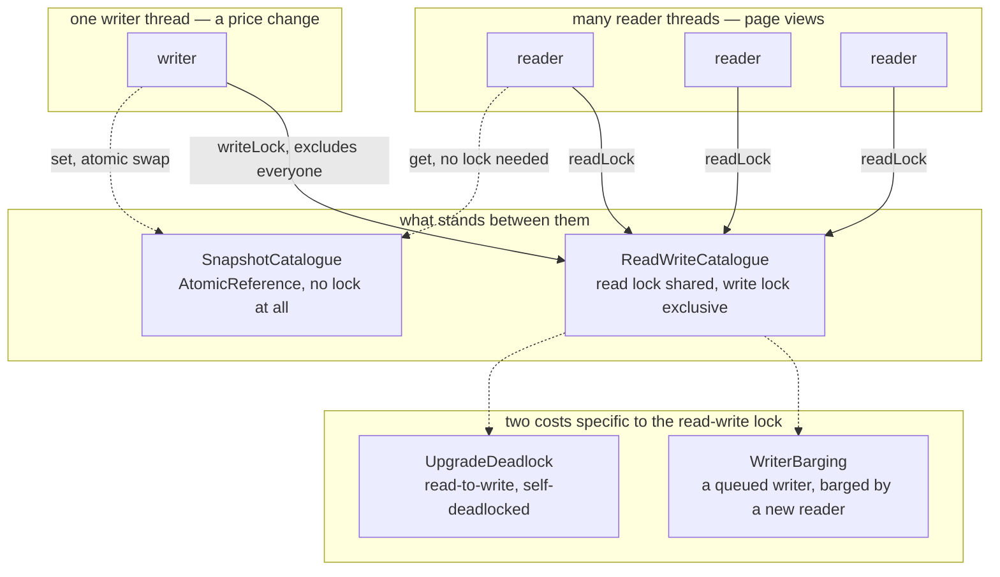

# Read–Write Lock Pattern — Architecture Diagram

Where each piece runs, and the one shared value every approach in this
project protects a different way.

Mermaid source

## Reading The Diagram

**Three arrows converge on `RWL` from the readers, and one from the
writer — but the diagram cannot show that this is where the coordination
cost also concentrates.** That cost is exactly what act three and act
six measure in code, because a static picture would make the pattern
look strictly better than the plain mutex, which this project's own
numbers say is not always true.

**`SNAP` has no incoming arrow from `Failure` at all.** Neither writer
starvation nor the upgrade deadlock is possible against an
`AtomicReference` — there is no read role and no write role to barge
between or upgrade from, only one atomic swap.
