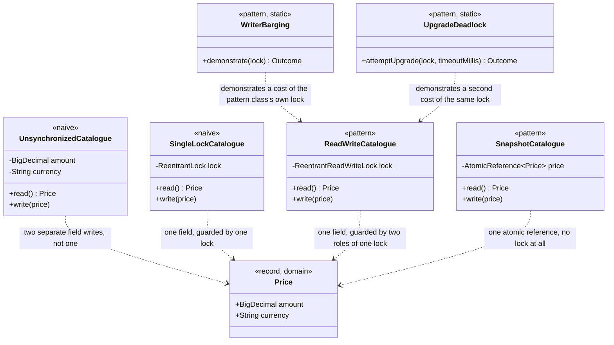

# Read–Write Lock Pattern — Class Diagram

The single most important thing on this diagram: three catalogue classes
share the exact same shape — a `read()` and a `write(Price)` — and differ
only in what stands between a caller and the `Price` field itself. The
diagram cannot show which one is fastest; that is the whole reason this
project measures it in code instead of arguing it in prose.

Mermaid source

## Reading The Diagram

**`UnsynchronizedCatalogue` is the only class with two separate fields
instead of one `Price`.** That is not an implementation detail — it is
the entire reason a torn read is even possible. Every other class holds
exactly one `Price` reference, guarded in a different way, and a `Price`
that has been fully constructed is never itself torn.

**`WriterBarging` and `UpgradeDeadlock` point at `ReadWriteCatalogue`,
not at the other two.** Both costs are specific to holding separate read
and write roles on one lock; a plain mutex has no read role to barge into
and nothing to upgrade from.
