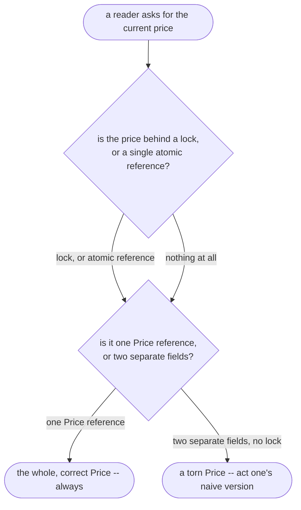

# Read–Write Lock Pattern — Data Flow Diagram

One read, from a request for the price to a value returned — or to a
torn value, if nothing is guarding the two fields underneath it.

Mermaid source

## Reading The Diagram

**`Torn` has exactly one path leading to it, and that path requires two
things to both be true: no guard, and two separate fields.** Change
either one — add any lock at all, or collapse the two fields into one
`Price` reference — and the torn path disappears entirely. This project's
naive version is deliberately built with both conditions true at once,
because either fix alone would already be enough.

**`Whole` is reachable through three different guards on this project's
own diagram** — `SingleLockCatalogue`, `ReadWriteCatalogue`, and
`SnapshotCatalogue` all reach it, by three different mechanisms with
three different costs, which is the entire subject
[`read-write-lock-pattern-explained.md`](read-write-lock-pattern-explained.md)
measures.
