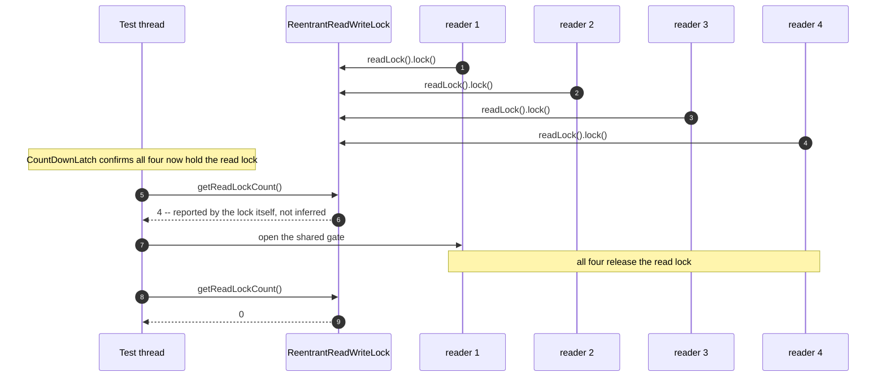

# Read–Write Lock Pattern — Sequence Diagram

Written for a listener with the screen off: who calls whom, and in what
order, when several readers genuinely hold the lock at the same moment.

Say it in words. Four reader threads each acquire the read lock, one
after another in whatever order the scheduler happens to run them, and
each one then parks — deliberately, at a closed gate, rather than
releasing the lock straight away. A counting latch confirms all four have
acquired the lock and are now parked before anything else happens. Only
then does the test ask the lock itself, not a guess, how many readers it
currently believes are holding it — and the lock reports four, because
all four genuinely are, at the same instant. Releasing the shared gate
lets all four readers release the read lock, and the same question asked
again now gets the answer zero.

Mermaid source

Say the load-bearing sentence aloud, because it is the one a picture
cannot carry on its own: **"four readers at once" is not asserted because
four threads were started — it is asserted because the lock's own
accounting, asked directly, reports four, at a moment every one of them
is confirmed still holding it.**

For the writer-barging mechanism, the upgrade deadlock, and the harness's
own lost-update proof, see [`uml-diagram.md`](uml-diagram.md).
