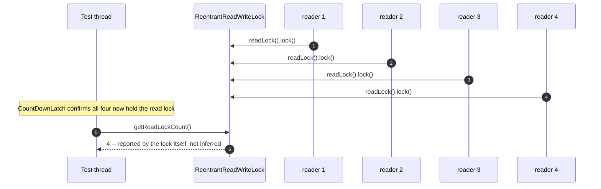
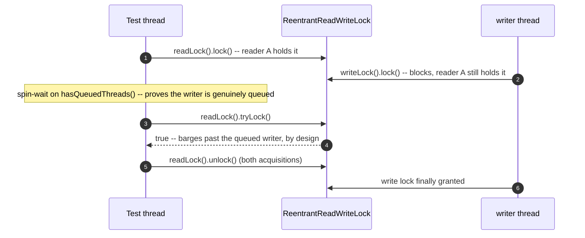
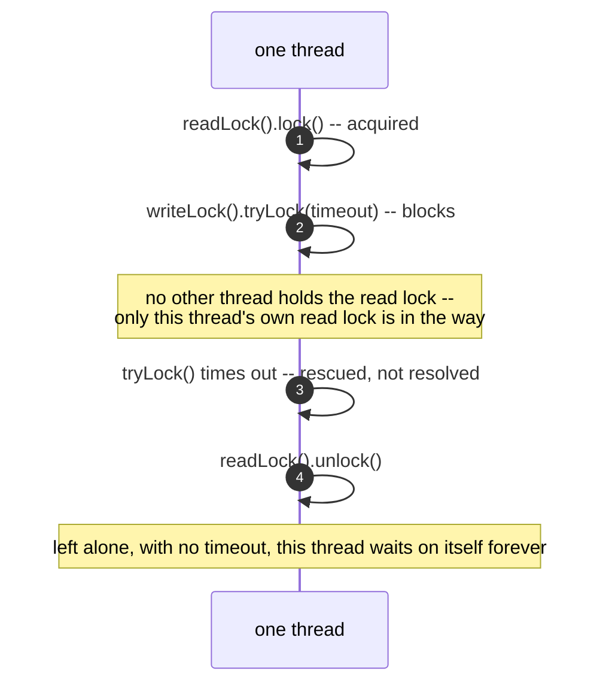
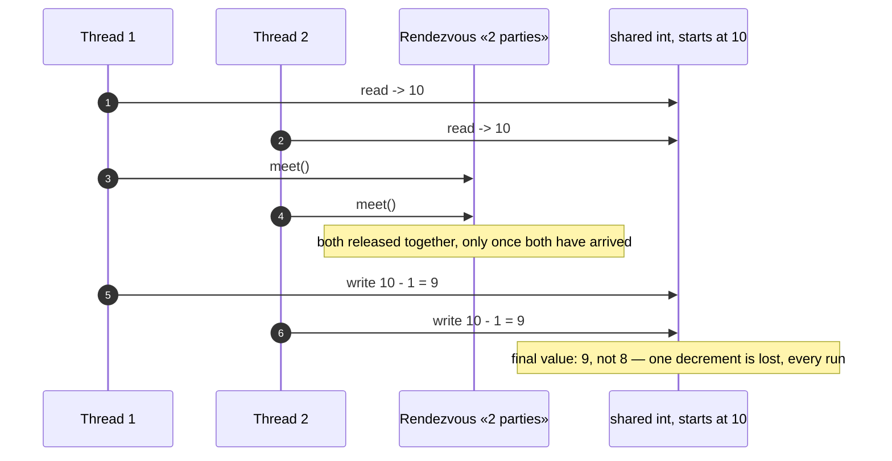

# Read–Write Lock Pattern — UML Sequence Diagrams

Four sequences: several readers held at once, a queued writer barged, the
upgrade deadlock, and the harness's own lost-update proof, copied
unchanged from §46.

## 1. Several Readers, Proven Held At The Same Moment

Mermaid source

## 2. A Queued Writer, Barged By A Fresh Reader

Mermaid source

## 3. Upgrading Read To Write Deadlocks The Same Thread

Mermaid source

## 4. The Harness's Own Proof — A Lost Update, Every Run

Mermaid source

This is the same mechanism §46 built and this project's `HarnessSelfTest`
proves again, copied unchanged, before act one relies on the same
determinism idea to force a torn read.
