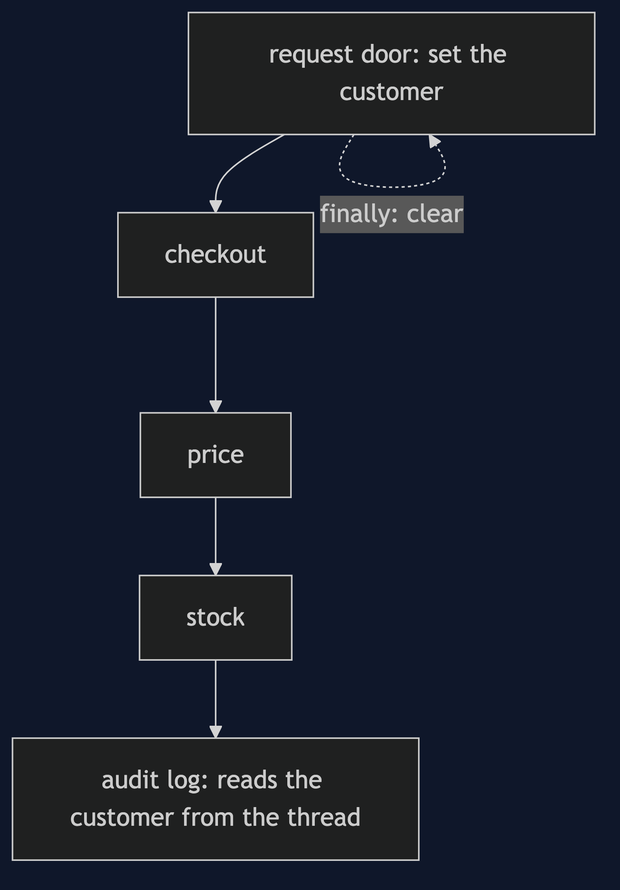
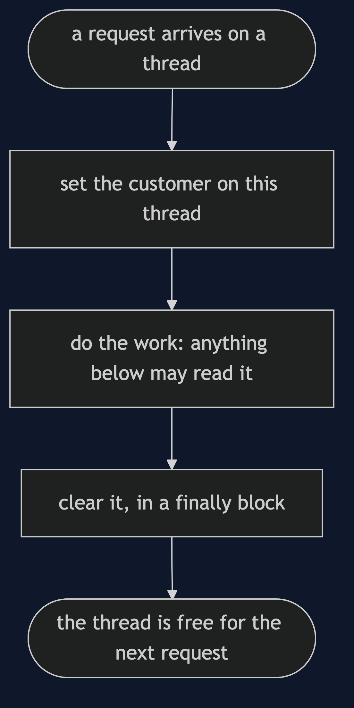
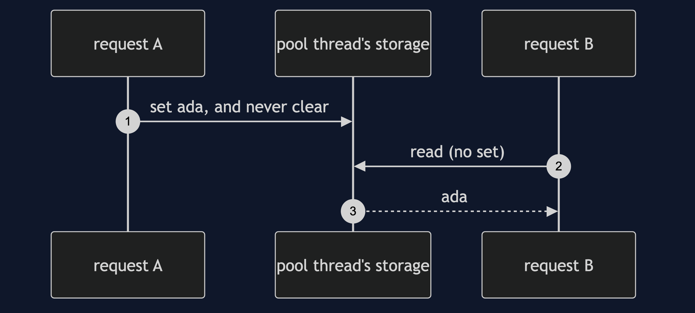

# Thread-Local Storage Pattern

```
src/main/java/com/jk/explore/threadlocalstorage/
├── ThreadLocalDemo.java             the six acts, and the layers of a request
├── RequestContext.java              a ThreadLocal: set, read, clear, and a helper that always clears
├── InheritedContext.java            an InheritableThreadLocal
└── Audit.java                       logs with an explicit customer, or from the context
```

**Thread-local storage gives each thread its own copy, so a value can be read anywhere on the thread without being passed.**

This project is in [concurrency-design-patterns](..). It is how Spring's security context and transaction context find themselves, and the reason [Thread Pool with Spring](../thread-pool-with-spring-pattern) needs a task decorator.

## Run

```bash
./gradlew run
```

Six acts. Every number quoted below comes from this program's own output.

```
ONE. Hand it down.
  three methods each take a customer parameter that they never use, so that the last can log it: [ada: reserved stock].
  every new layer, and every new caller, has to pass it on.
TWO. A value that belongs to the thread.
  the customer is set once, at the door. checkout, price and stock take no customer: [ada: reserved stock].
  after the request the context is cleared: null.
THREE. Each thread has its own.
  two customers at the same moment, both contexts set before either reads: [ada: reserved stock, ben: reserved stock].
  neither saw the other's, though both used the same code and the same static field.
FOUR. A thread that is reused.
  request A sets its customer and forgets to clear it. request B, an anonymous visitor, runs next on the same pool thread: [ada: reserved stock, ada: reserved stock].
  request B was logged as ada. a pool reuses its threads, so what a request leaves behind, the next one finds.
  with the clear in a finally block: [ada: reserved stock, null: reserved stock].
FIVE. A new thread starts empty.
  ada's request hands the work to another thread: [null: reserved stock].
  a thread created by ada's thread inherits a copy: ada. but a pool thread is created once and reused, so it holds whatever was there when it was created, not the current request's.
  handing work on means handing the context on, on purpose.
SIX. The bill.
  a method that reads the context has a dependency its signature does not show. called with none set: [null: reserved stock].
  every test of the code below the door has to remember to set the context first, and to clear it after.
  and a long-lived pool thread keeps whatever is left in it for as long as the thread lives.
```

## Test

```bash
./gradlew test
```

2 test classes, 9 test methods, offline, with nothing installed and no framework.

## Technologies and versions

| What | Version | Why it is here |
| --- | --- | --- |
| Java | 21 | The repository standard, via the Gradle toolchain block |
| Gradle | 9.2.1 | The wrapper in this directory; no separate install needed |
| JUnit 5 | 5.10.2 | Test runner |

No framework. A hand-built project stays plain Java so the mechanism is the whole lesson.

## Learning Material

| Document | What it covers |
| --- | --- |
| [`docs/problem-statement.md`](docs/problem-statement.md) | The scenario, and the problem |
| [`docs/thread-local-storage-pattern-explained.md`](docs/thread-local-storage-pattern-explained.md) | The pattern, and six acts |
| [`docs/class-diagram.md`](docs/class-diagram.md) | The types |
| [`docs/architecture-diagram.md`](docs/architecture-diagram.md) | The parts and how they connect |
| [`docs/data-flow-diagram.md`](docs/data-flow-diagram.md) | What happens to one request |
| [`docs/sequence-diagram.md`](docs/sequence-diagram.md) | Written for a listener with the screen off |
| [`docs/uml-diagram.md`](docs/uml-diagram.md) | Four sequences |
| [`docs/animation.html`](docs/animation.html) | The six acts in a browser |
| [`docs/prerequisites.md`](docs/prerequisites.md) | What you need to know |
| [`docs/session.md`](docs/session.md) | A one-hour taught session |
| [`docs/spec.md`](docs/spec.md) | The generated specification |
| [`docs/youtube.md`](docs/youtube.md) | Title, description and chapters |

### The pattern in one picture


### Where each piece sits



### How one request moves



### Who calls whom, in order


### All four sequences




### Video

Built from [`video/scenes.py`](video/scenes.py) by
[`video/build_video.sh`](video/build_video.sh). The rendered file is not
committed; see the repository README for why.

## Where you have already met this

Spring's security and transaction context, logging MDC, and every framework that seems to know who you are without being told.

## When this is too much

If a value is used in one or two places, pass it as a parameter, where it can be seen and tested. Thread-local state is global state with a thread's name on it.

## Where this sits

This project is in [`concurrency-design-patterns`](..), and is meant to be read with its neighbours there.
