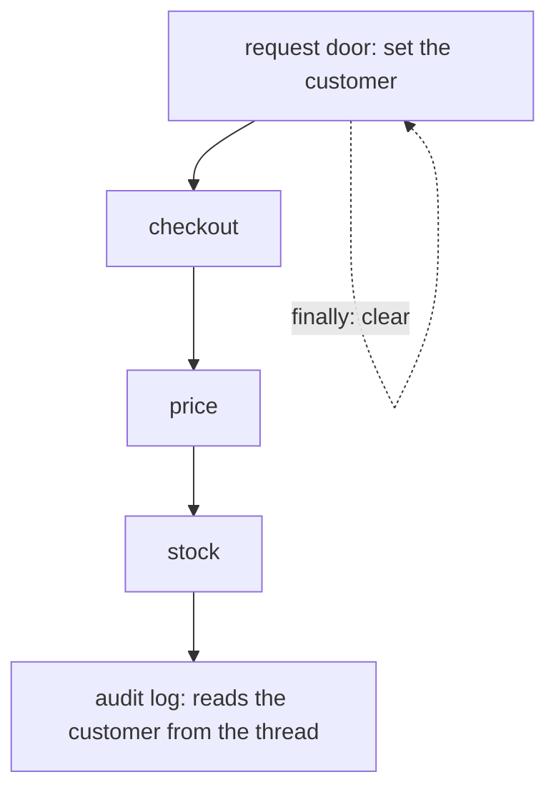

# Thread-Local Storage Pattern — Architecture Diagram

The door sets the context on the thread. Everything below the door reads it.

Mermaid source

```mermaid
flowchart TD
    D["request door: set the customer"] --> C["checkout"]
    C --> P["price"]
    P --> S["stock"]
    S --> A["audit log: reads the customer from the thread"]
    D -.->|finally: clear| D
```

