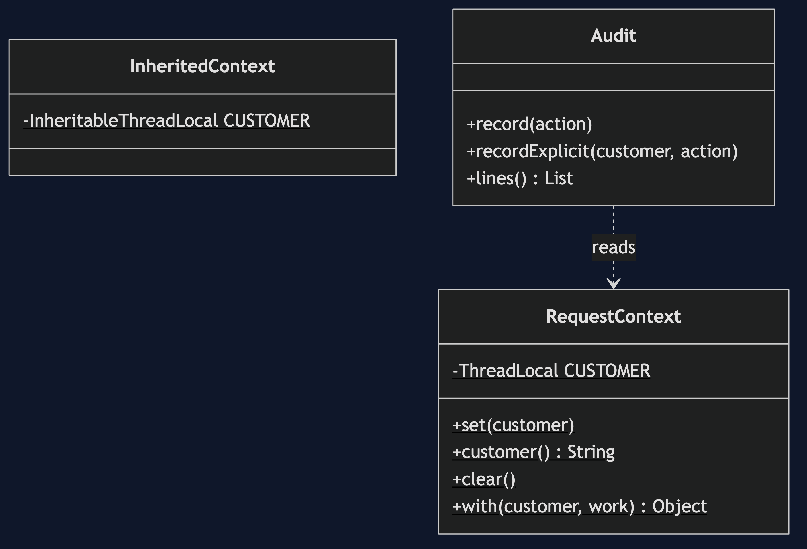
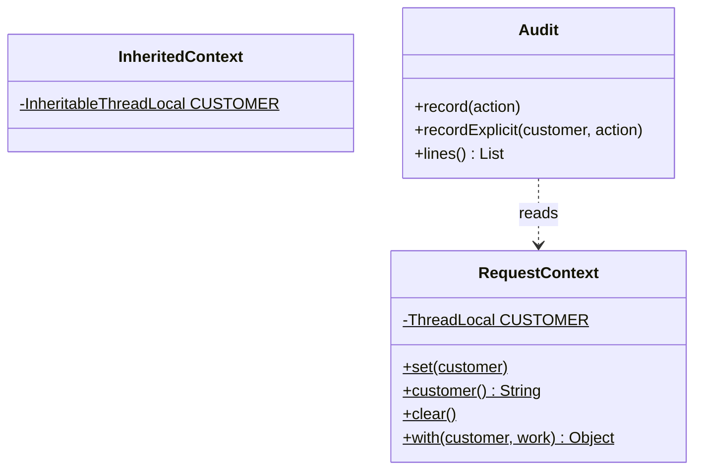

# Thread-Local Storage Pattern — Class Diagram

A thread-local holds the customer. The audit log reads it.

Mermaid source

```mermaid
classDiagram
    class RequestContext {
        -ThreadLocal CUSTOMER$
        +set(customer)$
        +customer()$ String
        +clear()$
        +with(customer, work)$ Object
    }
    class InheritedContext {
        -InheritableThreadLocal CUSTOMER$
    }
    class Audit {
        +record(action)
        +recordExplicit(customer, action)
        +lines() List
    }
    Audit ..> RequestContext : reads
```

