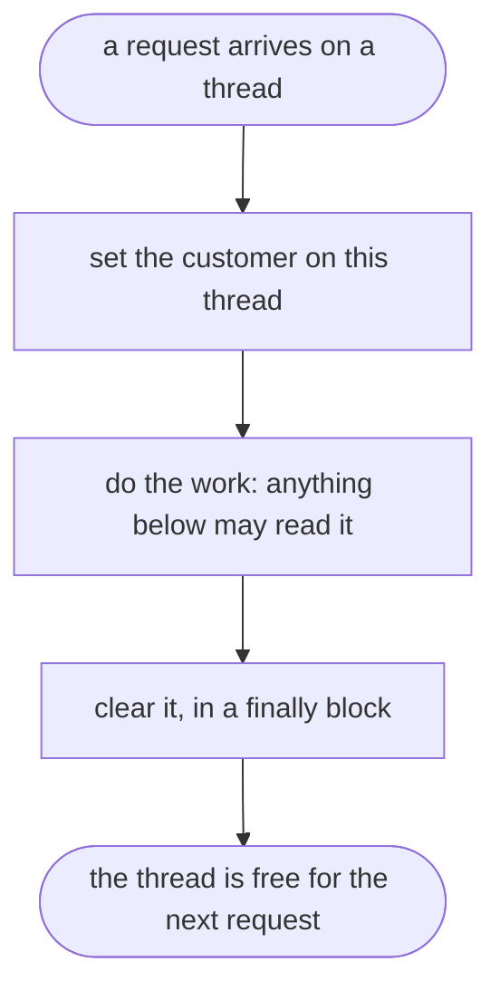

# Thread-Local Storage Pattern — Data Flow Diagram

What happens to the context in one request.

Mermaid source

```mermaid
flowchart TD
    In(["a request arrives on a thread"])
    Set["set the customer on this thread"]
    Work["do the work: anything below may read it"]
    Clear["clear it, in a finally block"]
    Out(["the thread is free for the next request"])
    In --> Set --> Work --> Clear --> Out
```

