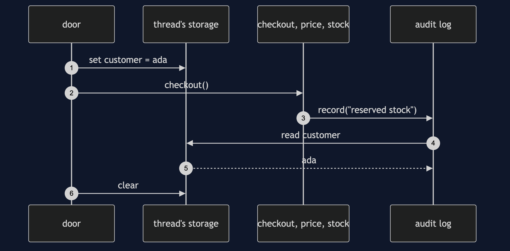
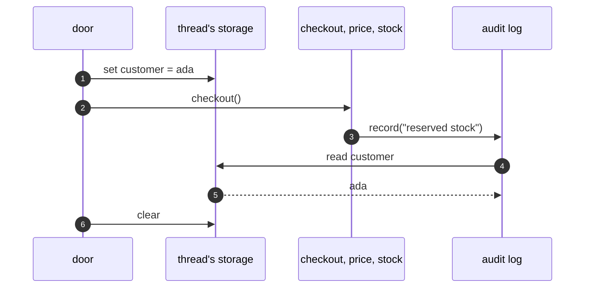

# Thread-Local Storage Pattern — Sequence Diagram

Written for a listener with the screen off.

Say it in words. A request arrives on thread one. The door sets the customer to ada on that thread. Checkout calls price, price calls stock, and stock calls the audit log. The audit log reads the customer from the thread, and writes: ada, reserved stock. Nobody passed ada down. When the request ends, the door clears the value, so the next request on this thread starts empty.

Mermaid source

The load-bearing sentence: **the value travels with the thread, not through the method calls.**
