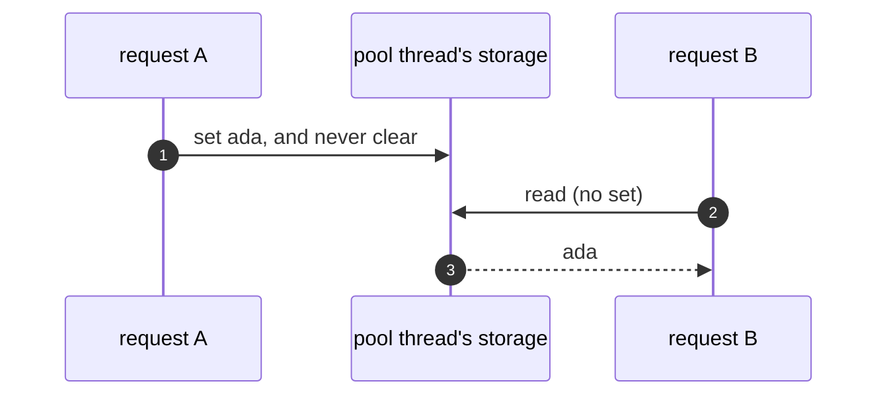

# Thread-Local Storage Pattern — UML Sequence Diagrams

Four sequences.

## 1. A Leak

Mermaid source

```mermaid
sequenceDiagram
    autonumber
    participant A as request A
    participant T as pool thread's storage
    participant B as request B
    A->>T: set ada, and never clear
    B->>T: read (no set)
    T-->>B: ada
```

