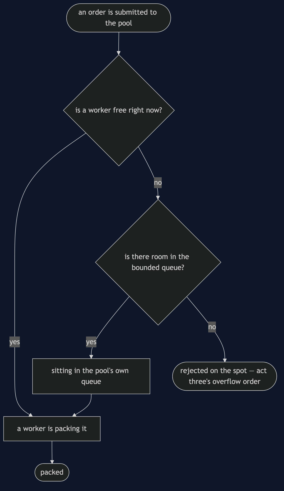
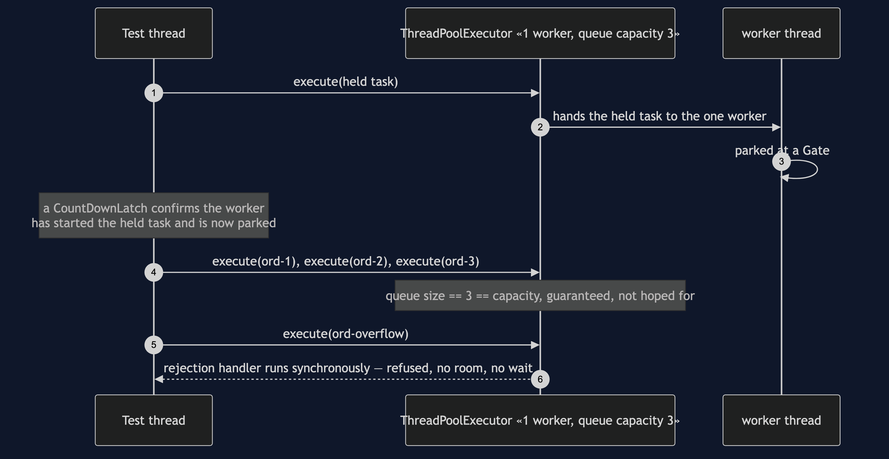
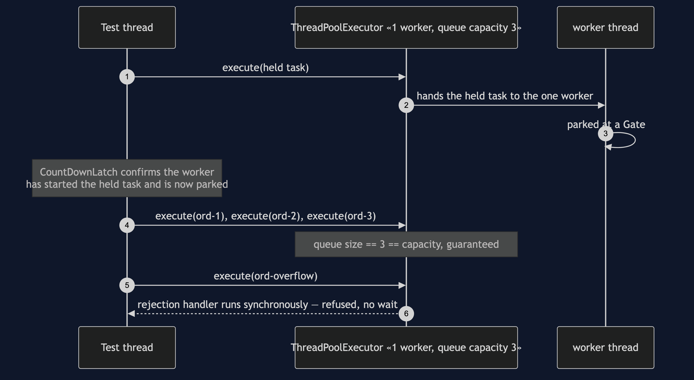
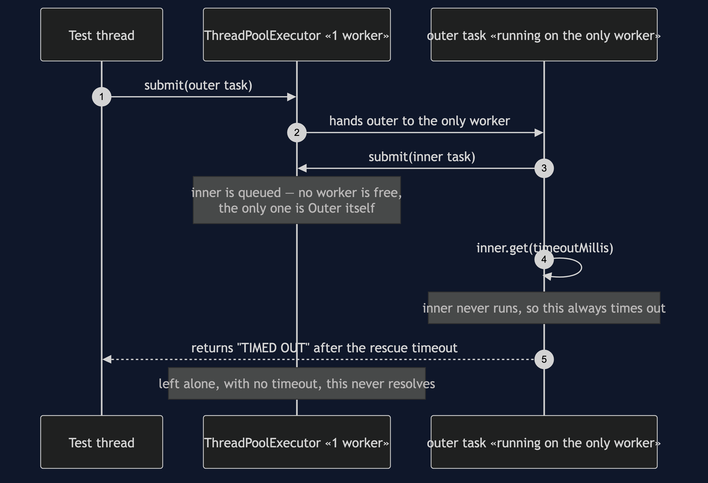
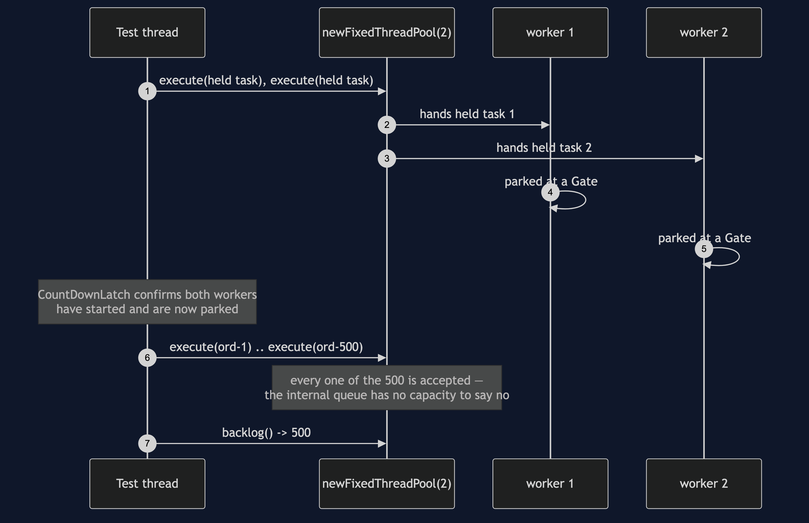

# Thread Pool Pattern

```
src/main/java/com/jk/explore/threadpool/
├── PackingTeamDemo.java             composition root — the six acts
│
├── domain/                          ← reused unchanged from §46
│   ├── Order.java                    record(id, sku)
│   └── Packing.java                  «functional interface» pack(order)
├── harness/                         ← reused unchanged from §46
│   ├── Gate.java
│   ├── Rendezvous.java
│   └── StepExecutor.java
├── naive/                           ← one bound, or none
│   ├── ThreadPerOrderPacking.java    no worker bound, no queue at all
│   └── UnboundedPoolPacking.java     bounded workers, unbounded queue
│
└── pattern/                         ← the real thing
    ├── BoundedPackingPool.java       two bounds: workers, and queue capacity
    ├── PoolStarvation.java           the deadlock any fixed pool can reach
    └── VirtualThreadFlood.java       Java's answer, measured honestly
```

**A fixed, small number of worker threads is created once and reused for
every task handed to it, pulling from a queue whose own capacity is also
chosen on purpose — not one bound, but two.**

This is the second project in
[concurrency-design-patterns](..), picking up directly from
[Producer–Consumer](../producer-consumer-pattern)'s queue and harness: the
packer becomes a team, and a team needs a second decision the first
project never had to make.

## Run

```bash
./gradlew run
```

Six acts.

Act one is the identical thread-per-order failure, from the team's side.

```
ONE. A thread per order — the same cost §46 measured, from the team's side.
  created 2,000 real threads in 98.1ms (49.1 microseconds each)
  every thread is live and holding a stack until its order is packed —
  nothing here caps how many pile up if orders outpace packing.
```

Act two is the trap the JDK's own factory method hides.

```
TWO. A fixed pool with the queue nobody chose — the default trap.
  2 workers, both provably busy; 500 more orders submitted
  Executors.newFixedThreadPool never blocked and never rejected once
  backlog waiting behind the 2 busy workers: 500
  nothing anywhere would have told you that number until you asked.
```

Act three is the pattern — two bounds, both chosen on purpose, and a
rejection with no patience window.

```
THREE. The pattern — a bound on workers, and a bound on the queue.
  1 worker busy, queue filled to capacity 3: 3
  one more order, submitted with the worker busy and the queue full: REJECTED on the spot — no patience window, no room
```

Act four is the bill for sizing, in both directions.

```
FOUR. Sizing the pool is a real decision, both directions.
  too few workers: the queue in act two grew by 500 before anyone asked why.
  too many workers: each one is a stack, same cost as act one, just capped.
  there is no size that is free; there is only a size chosen on purpose.
```

Act five is a deadlock any fixed pool can reach, at any size.

```
FIVE. Pool starvation — a task waiting on a task in its own pool.
  a fixed pool of 1: the running task submits a second task to that
  same pool and waits for its result — no free worker will ever run it.
  starved: true, rescued after 210ms by a demonstration timeout; left alone, this never resolves.
```

Act six is Java's answer, measured honestly against act one.

```
SIX. Java's answer — virtual threads change the creation cost, not the bound.
  created 2,000 virtual threads in 11.4ms (5.68 microseconds each)
  compare act one: same count, real platform threads, measured the same way.
  cheap thread-per-task is viable again for blocking I/O — but a pool still
  bounds a resource, not a thread count; a downstream limit of ten stays ten
  connections wide no matter how many virtual threads ask for one.
```

## Test

```bash
./gradlew test
```

Seven test classes, 11 test methods between them, several run twenty
times each via `@RepeatedTest` — 125 executions total, zero of them using
`Thread.sleep` to wait for another thread. `BoundedPackingPoolTest` proves
both bounds are reached deterministically; `PoolStarvationTest` proves the
deadlock always starves at pool size one and never at pool size two;
`UnboundedPoolPackingTest` proves the hidden trap with a real, exact
backlog number rather than a claim.

## Technologies and versions

| What | Version | Why it is here |
| --- | --- | --- |
| Java | 21 | The repository standard, via the Gradle toolchain block — also what act six's virtual threads need |
| Gradle | 9.2.1 | The wrapper in this directory; no separate install needed |
| JUnit 5 | 5.10.2 | Test runner — `@RepeatedTest` is how this project proves a race, not merely exercises it |

No ArchUnit, no Spring, no framework of any kind. `java.util.concurrent`
is this category's entire subject, including `ThreadPoolExecutor` itself —
the pattern class wraps it directly rather than reimplementing it.

## Learning Material

| Document | What it covers |
| --- | --- |
| [`docs/problem-statement.md`](docs/problem-statement.md) | The naive versions, continued from §46, and what the pattern has to deliver |
| [`docs/thread-pool-pattern-explained.md`](docs/thread-pool-pattern-explained.md) | Two bounds, rejection with no patience, the starvation deadlock, virtual threads |
| [`docs/determinism.md`](docs/determinism.md) | How each scenario is forced, and the one that needs no forcing at all |
| [`docs/class-diagram.md`](docs/class-diagram.md) | The types, and the two bounds `BoundedPackingPool` owns |
| [`docs/architecture-diagram.md`](docs/architecture-diagram.md) | Where each piece runs, and the failure that reaches back into the worker box |
| [`docs/data-flow-diagram.md`](docs/data-flow-diagram.md) | One order, submitted to packed or rejected on the spot |
| [`docs/sequence-diagram.md`](docs/sequence-diagram.md) | Who calls whom, in order — written for a listener with the screen off |
| [`docs/uml-diagram.md`](docs/uml-diagram.md) | Four sequences: capacity reached, pool starvation, the unbounded trap, the harness's own proof |
| [`docs/animation.html`](docs/animation.html) | The six acts in a browser |
| [`docs/prerequisites.md`](docs/prerequisites.md) | What you need to know, including what §46 already covered |
| [`docs/session.md`](docs/session.md) | A one-hour taught session with exercises |
| [`docs/spec.md`](docs/spec.md) | The generated specification, with measured test counts and timings |
| [`docs/youtube.md`](docs/youtube.md) | Title, description and chapters for the video |

### The pattern in one picture

The single most important thing on this diagram: `BoundedPackingPool` owns
two bounds, not one — `workers` and `queueCapacity` — and both are
constructor arguments, chosen on purpose, rather than defaults buried
inside a factory method.


### Where each piece runs

Two boxes stand between submission and packing, not one — and the
starvation deadlock points back into the worker box itself, not around
it.


### How one order moves

There is no patience step: a submission either finds room immediately or
it is refused, in the same call.



### Who calls whom, in order

The sequence written to work with the screen off: a test thread parks a
pool's one worker mid-task behind a closed gate, confirms with a latch —
not a guess — that it is truly stuck there, fills the queue to its
capacity of three, and watches a fourth submission refused inside the
very call that made it.



### All four sequences

The full set from [`docs/uml-diagram.md`](docs/uml-diagram.md).

**One. The pool's queue reaches capacity, and says no.**



**Two. Pool starvation — a task waiting on a task in its own pool.** No
forcing needed: a pool of one worker waiting on itself has exactly one
outcome.



**Three. The unbounded-queue trap — a backlog with no ceiling.** Five
hundred submissions, every one accepted, with two workers both provably
elsewhere.



**Four. The harness's own proof — a lost update, every run.** The same
mechanism §46 built, proven again before this project's own acts rely on
it.


### Video

The narrated walkthrough is built from
[`video/scenes.py`](video/scenes.py) by
[`video/build_video.sh`](video/build_video.sh). The rendered file is not
committed — see the repository README for why.

## When this is too much

Worth it the moment more than one worker genuinely helps — CPU-bound work
that can run in parallel, or I/O-bound work under Java's traditional
platform-thread model where creation cost matters. Not worth it for a
single background task that runs once; a pool sized for concurrency it
will never use is ceremony with nothing to bound.

## Where this sits

This is the second of six projects in
[`concurrency-design-patterns`](..), reusing §46's queue idea, domain and
harness directly rather than re-deriving them.

The next project, **Future/Promise**, answers a question this project
leaves open on purpose: once a worker has taken an order, how does the
caller ever find out the result.

## Also available with a framework

[Thread Pool with Spring Pattern](../thread-pool-with-spring-pattern) reruns this idea on a real framework, and shows what the framework adds and where it can undo the pattern. Watch this project first.
