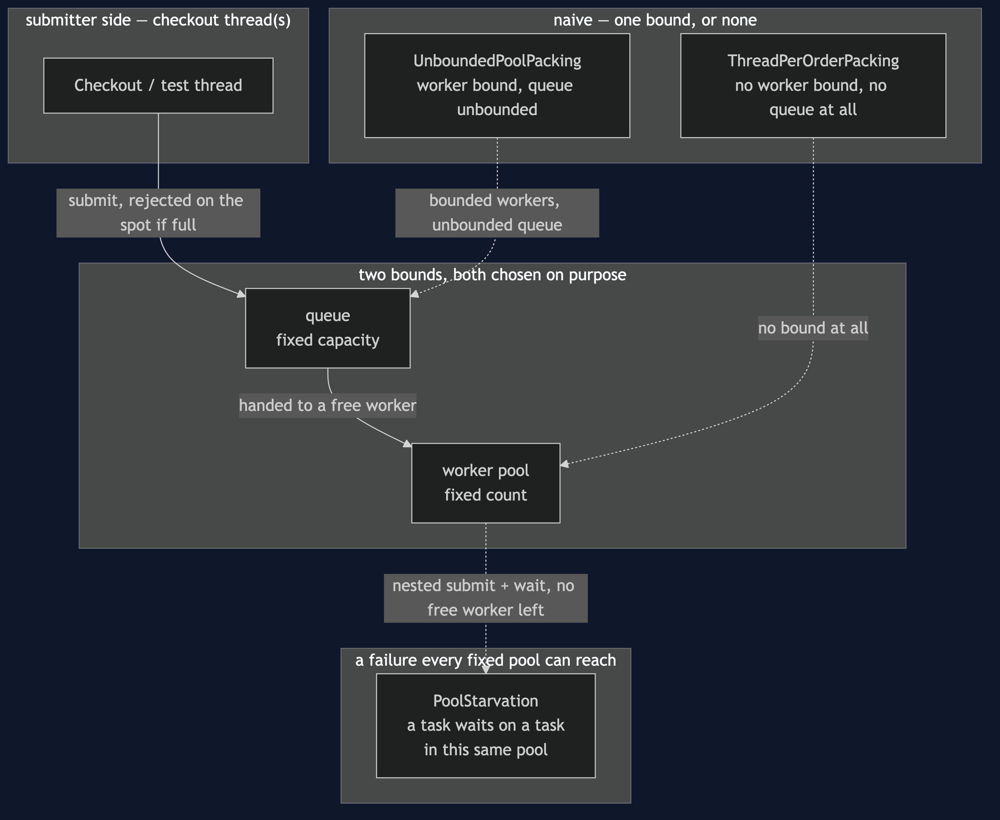
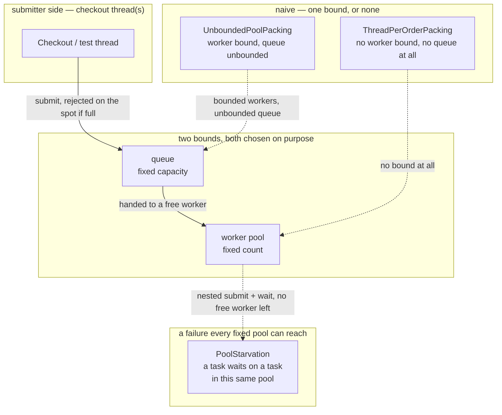

# Thread Pool Pattern — Architecture Diagram

Where each piece runs, and the two separate bounds that stand between an
order arriving and it actually being packed.

Mermaid source

## Reading The Diagram

**Two boxes sit between submission and packing, not one.** §46's diagram
had a single bounded queue; this one adds the worker pool itself as a
second, separate bound — and the naive path shows what happens with only
one of the two in place, or neither.

**`PoolStarvation` points back into the worker box, not around it.** The
deadlock it demonstrates is not a missing bound — the pool in that
scenario is bounded correctly. It is what a bounded pool does when a task
already inside it asks the same pool for a second worker that does not
exist.
