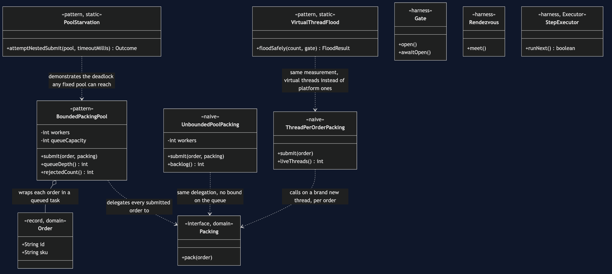
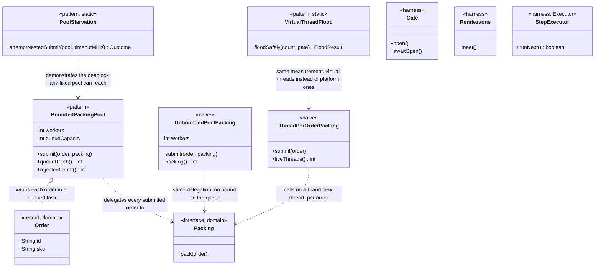

# Thread Pool Pattern — Class Diagram

The single most important thing on this diagram: `BoundedPackingPool` owns
two bounds, not one — `workers` and `queueCapacity` — and both are
constructor arguments, chosen on purpose, rather than defaults buried
inside a factory method.

Mermaid source

## Reading The Diagram

**`BoundedPackingPool` has two bounds where `UnboundedPoolPacking` has
one.** Both wrap the same idea — a fixed set of workers — but only the
pattern version also bounds what is allowed to wait behind them. That
second bound is the entire diagram's argument: a class with a worker count
and nothing else has fixed one leak and left another one open.

**`PoolStarvation` and `VirtualThreadFlood` are not alternatives to
`BoundedPackingPool` — they are static demonstrations about pools in
general**, which is why neither one is a wrapper around a queue the way
the other three classes are. One shows a failure any fixed pool can reach;
the other shows what changed, and what did not, about the cost `ThreadPerOrderPacking`
measures.
