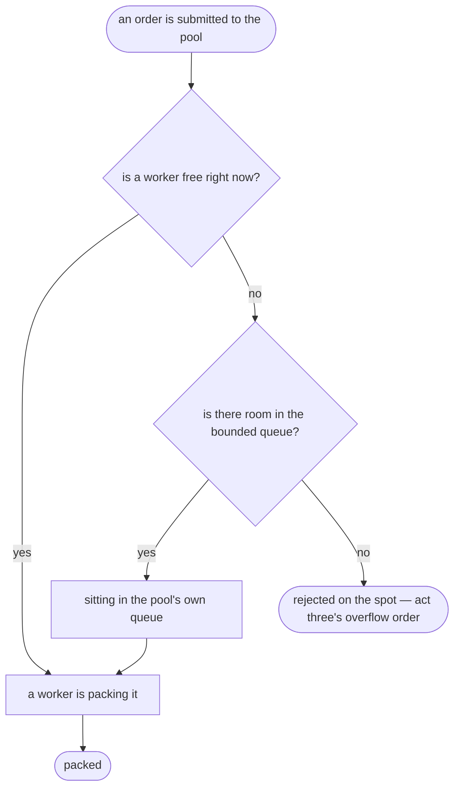

# Thread Pool Pattern — Data Flow Diagram

One order, from submission to being packed — or to being rejected on the
spot, with no wait in between.

Mermaid source

## Reading The Diagram

**There is no patience step anywhere on this diagram.** §46's diagram had
a decision node checking a timeout before rejecting; this one checks
`QueueRoom` exactly once, synchronously, inside the same call that
submitted the order. `execute()` either finds room immediately or it does
not — there is nothing to wait for.

**`Queued` has exactly one arrow leaving it, and it always leads to
`Running`.** Unlike §46, where an order sitting in the queue could still
end up lost if the packer was interrupted first, a task that reaches this
pool's queue is guaranteed a worker eventually — the pool itself is never
shut down mid-order in this project's scenarios. What can leave an order
stuck forever is not shown on this diagram at all, because it lives one
level up: a worker that is itself waiting on another task in the same
pool, which `docs/architecture-diagram.md` shows separately.
