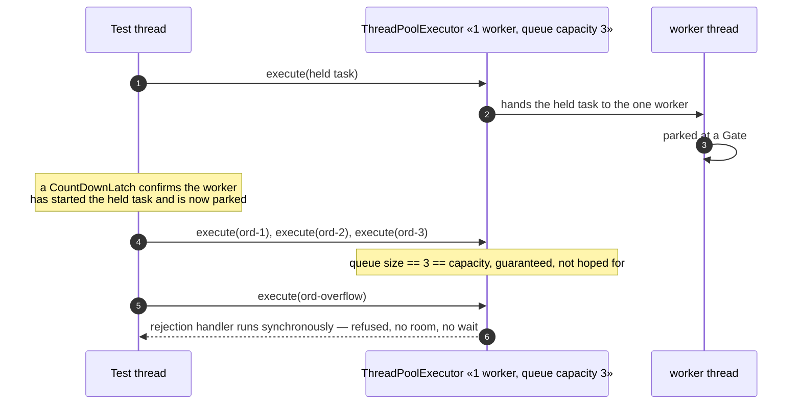

# Thread Pool Pattern — Sequence Diagram

Written for a listener with the screen off: who calls whom, and in what
order, when a fixed pool's queue is genuinely full.

Say it in words. A test thread submits one task to a pool with exactly one
worker, and that worker picks it up immediately and parks — deliberately,
at a closed gate, rather than doing real work — so it never comes back for
a second task. Only once the test thread has confirmed, with a latch
rather than a guess, that the worker really is stuck there, does it
submit three real orders. Each one lands in the pool's own queue, because
the only worker that could have taken any of them is busy elsewhere, and
the queue's capacity of three is now exactly full. A fourth order is then
submitted. There is no patience window here, unlike the plain bounded
queue two projects back — the pool's rejection handler runs immediately,
in the same call, on the test thread itself, and the test thread is told
the order was refused before that call even returns.

Mermaid source

Say the load-bearing sentence aloud, because it is the one a picture
cannot carry on its own: **the fourth order is not refused after a wait —
it is refused inside the very call that submitted it, because the
rejection handler is not something the caller waits to hear from later,
it is code that runs on the caller's own thread before that call
returns.**

For the pool-starvation deadlock and the harness's own lost-update proof,
see [`uml-diagram.md`](uml-diagram.md).
