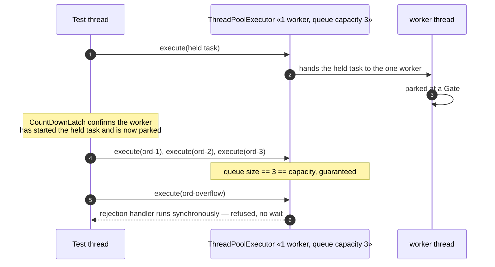
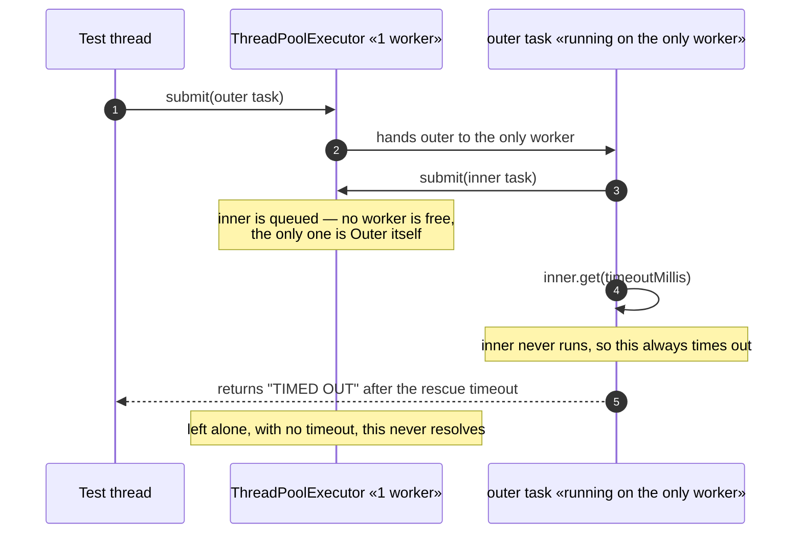
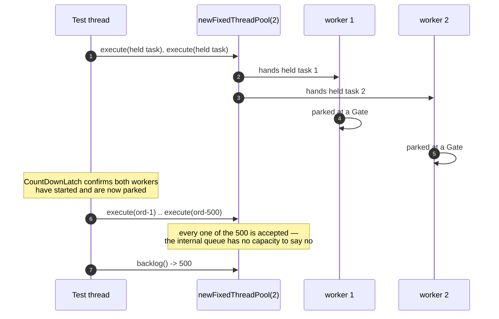
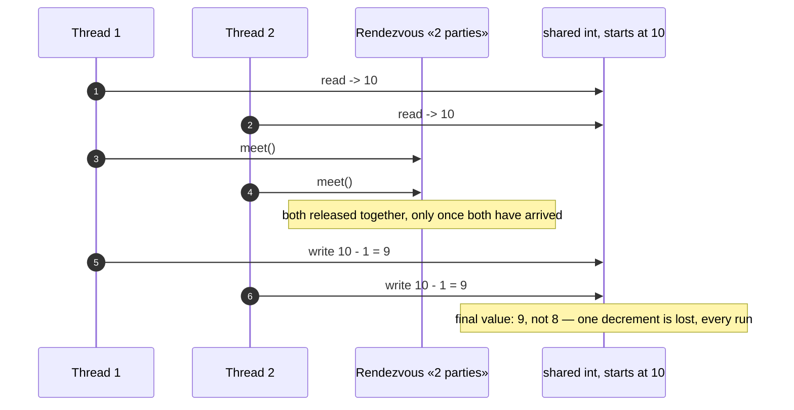

# Thread Pool Pattern — UML Sequence Diagrams

Four sequences: the pool's queue at capacity, the pool-starvation
deadlock, the unbounded-queue trap, and the harness's own lost-update
proof, copied unchanged from §46.

## 1. The Pool's Queue Reaches Capacity, And Says No

Mermaid source

## 2. Pool Starvation — A Task Waiting On A Task In Its Own Pool

Mermaid source

## 3. The Unbounded-Queue Trap — A Backlog With No Ceiling

Mermaid source

## 4. The Harness's Own Proof — A Lost Update, Every Run

Mermaid source

This is the same mechanism §46 built and this project's `HarnessSelfTest`
proves again, copied unchanged, before act two or act three relies on it.
