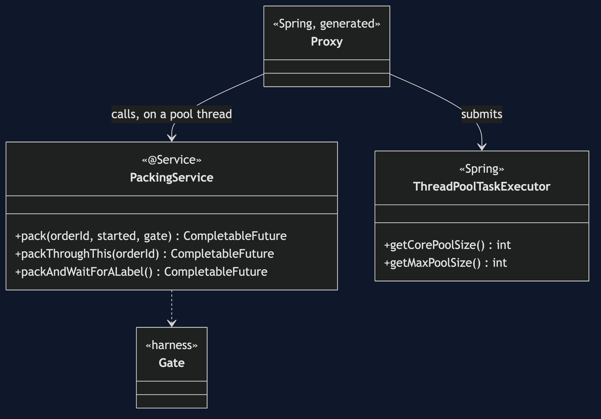
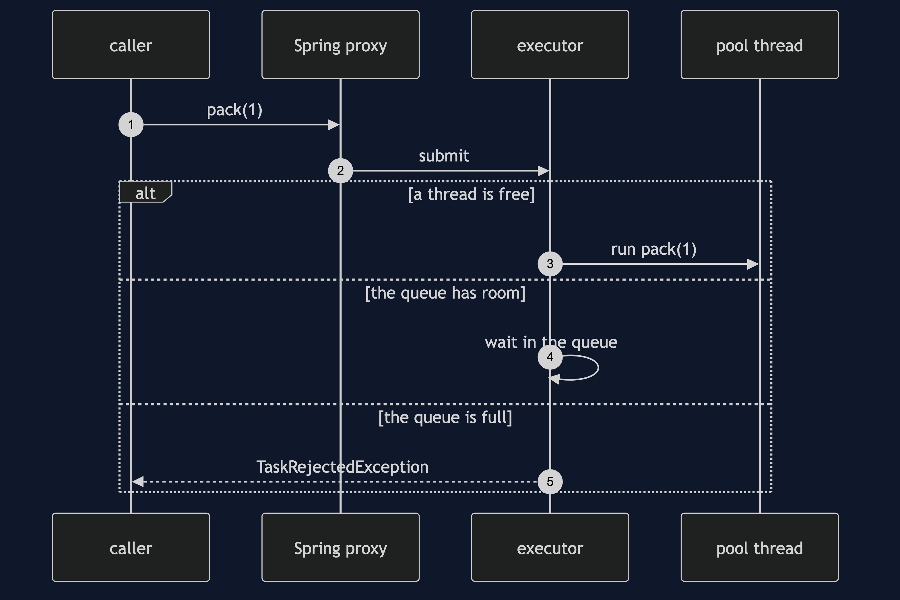
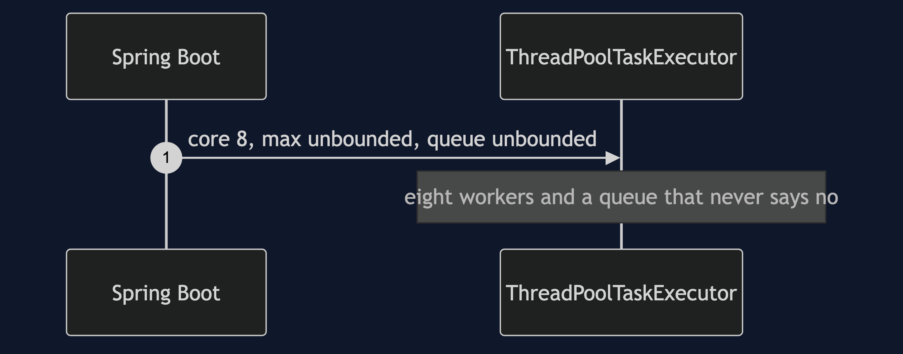
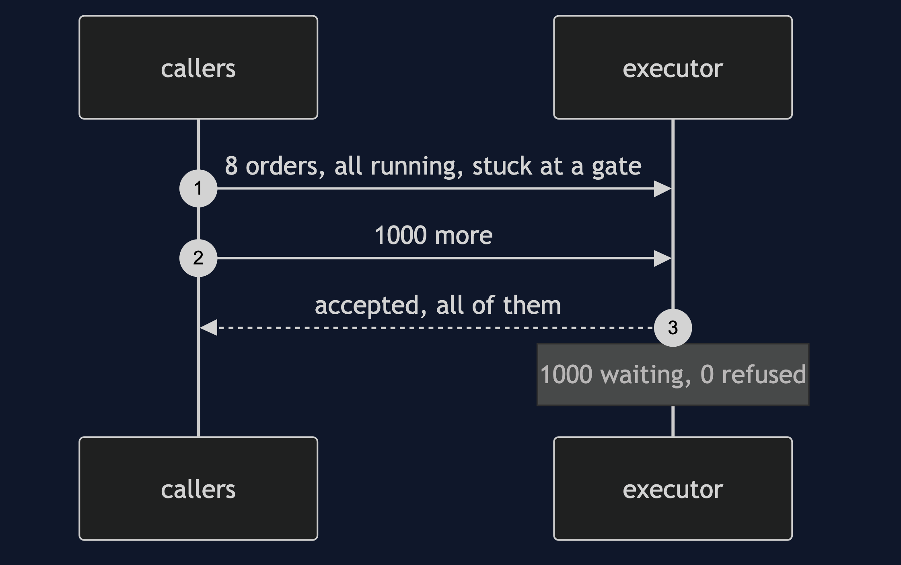
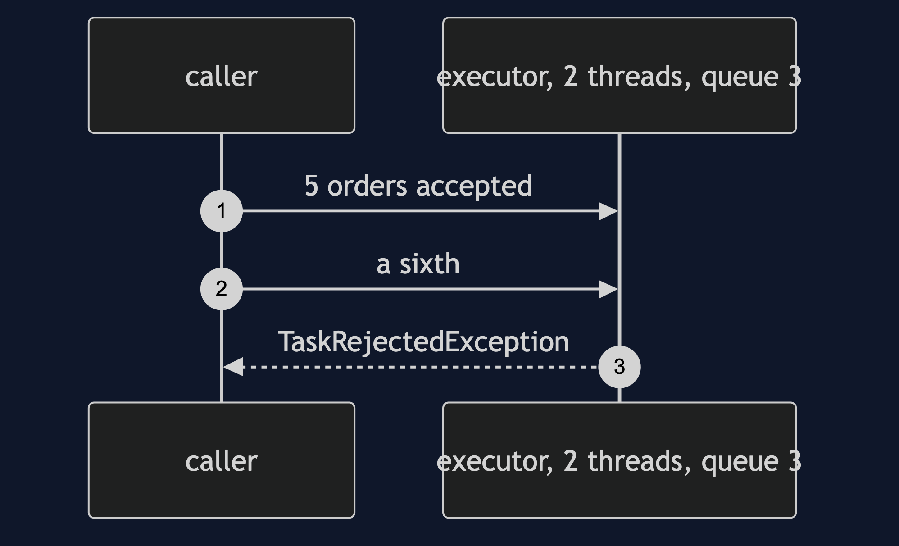
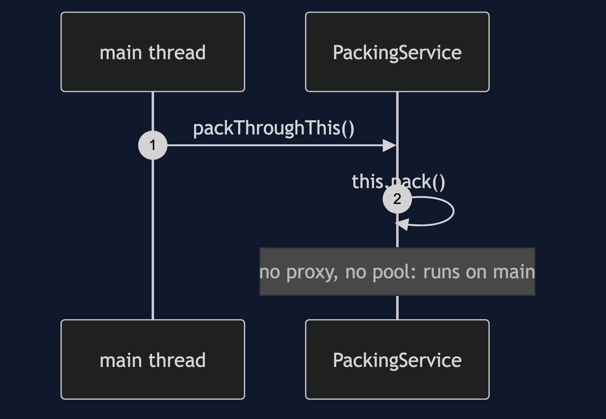

# Thread Pool with Spring Pattern

```
src/main/java/com/jk/explore/threadpoolspring/
├── PackingApplication.java          the Spring Boot entry point and the six acts
├── PackingService.java              @Async methods: pack, a call through this, and a nested wait
└── Gate.java                        the harness's gate, copied from the partner
```

**`@Async` sends a method to a thread pool Spring owns. The pool's shape is configuration, and its default is an unbounded queue.**

This project is the framework version of [Thread Pool](../thread-pool-pattern). That project built the mechanism by hand. This one shows the same idea inside Spring Boot. It does not re-teach the pattern. It shows what Spring Boot adds, the failures that are its own, and what it costs.

## Run

```bash
./gradlew run
```

Six acts. The partner project, Thread Pool, built the mechanism by hand. Here the same idea runs through Spring Boot, and every count comes from real output.

```
THREAD POOL WITH SPRING — the executor behind @Async

ONE. What Spring Boot gives you when you configure nothing.
  @EnableAsync and no settings. the executor is a ThreadPoolTaskExecutor:
  core threads 8, max threads 2147483647, queue capacity 2147483647.
  eight workers, and a queue with no bound. this is the partner project's unbounded-queue trap, as a default.

TWO. @Async moves the work to another thread.
  the caller is thread "main". the work ran on "task-1".
  one annotation replaced the partner's BoundedPackingPool class.

THREE. The unbounded queue, with the workers busy.
  all 8 workers are stuck on a slow step. 1000 more orders arrive.
  waiting in the queue: 1000. rejected: 0. nobody was told.
  submitting never blocks and never refuses. the backlog just grows, until it is a heap dump instead of a decision.

FOUR. Bound it, and the refusal is a real exception.
  three settings: 2 threads, a queue of 3. two orders are running and three are waiting.
  the sixth order: TaskRejectedException, thrown to the caller, at once.
  that is a decision: the caller learns the pool is full, instead of a queue growing in silence.

FIVE. The annotation that does nothing.
  packThroughThis() called pack(), which is @Async, through this. it ran on "main", the caller's own thread.
  @Async works through a proxy, exactly as @Transactional does. a call on this skips it, and nothing complains.

SIX. Pool starvation: a task that waits for a task on its own pool.
  one thread. the packing task asks the pool to print a label, and waits for it.
  starved: the label task never got a thread
  the label task is queued behind the packing task, which is waiting for it. the same deadlock as the partner's act five.
  verdict: set the pool explicitly, bound the queue, and never wait on your own pool.
  where you have met this: every @Async method, and Spring Boot's applicationTaskExecutor.
```

## Test

```bash
./gradlew test
```

2 test classes, 8 test methods, offline, with each Spring context started inside the test, and no server.

## Technologies and versions

| What | Version | Why it is here |
| --- | --- | --- |
| Java | 21 | The repository standard, via the Gradle toolchain block |
| Gradle | 9.2.1 | The wrapper in this directory; no separate install needed |
| Spring Boot | 4.1.1 | The container, `@Async`, and the default executor |
| JUnit 5 | 5.10.2 | Test runner |

See [`docs/dependencies.md`](docs/dependencies.md).

## Learning Material

| Document | What it covers |
| --- | --- |
| [`docs/problem-statement.md`](docs/problem-statement.md) | The partner's pool, and what is new |
| [`docs/thread-pool-with-spring-pattern-explained.md`](docs/thread-pool-with-spring-pattern-explained.md) | The default, the annotation, and the failures that are Spring's own |
| [`docs/class-diagram.md`](docs/class-diagram.md) | The types |
| [`docs/architecture-diagram.md`](docs/architecture-diagram.md) | A caller, Spring's pool and its queue |
| [`docs/data-flow-diagram.md`](docs/data-flow-diagram.md) | One @Async call: proxy, queue, or refusal |
| [`docs/sequence-diagram.md`](docs/sequence-diagram.md) | Written for a listener with the screen off |
| [`docs/uml-diagram.md`](docs/uml-diagram.md) | Four sequences |
| [`docs/animation.html`](docs/animation.html) | The six acts in a browser |
| [`docs/prerequisites.md`](docs/prerequisites.md) | What you need to know |
| [`docs/session.md`](docs/session.md) | A one-hour taught session |
| [`docs/spec.md`](docs/spec.md) | The generated specification |
| [`docs/youtube.md`](docs/youtube.md) | Title, description and chapters |
| [`docs/dependencies.md`](docs/dependencies.md) | What Spring Boot is, what it costs, and that skipping this project loses none of the pattern |

### The pattern in one picture



### Where each piece sits


### How one request moves


### Who calls whom, in order



### All four sequences









### Video

Built from [`video/scenes.py`](video/scenes.py) by
[`video/build_video.sh`](video/build_video.sh). The rendered file is not
committed; see the repository README for why.

## Where you have already met this

Every `@Async` method, and Spring Boot's `applicationTaskExecutor`. `@Scheduled` and `@EventListener` with `@Async` use the same kind of pool.

## When this is too much

For work that is already fast, or that must finish before the caller continues, a thread pool is only overhead.

## Where this sits

This project pairs with [Thread Pool](../thread-pool-pattern), and is a framework version in [`concurrency-design-patterns`](..).
