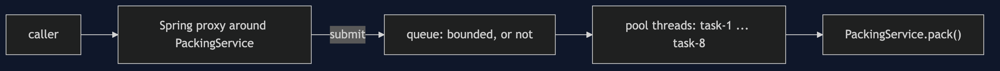
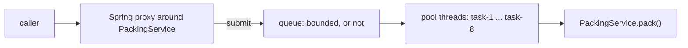

# Thread Pool with Spring Pattern — Architecture Diagram

The caller talks to a proxy. The proxy submits to the pool. The pool's queue holds the rest.

Mermaid source

```mermaid
flowchart LR
    C["caller"] --> P["Spring proxy around PackingService"]
    P -->|submit| Q["queue: bounded, or not"]
    Q --> T["pool threads: task-1 ... task-8"]
    T --> S["PackingService.pack()"]
```

