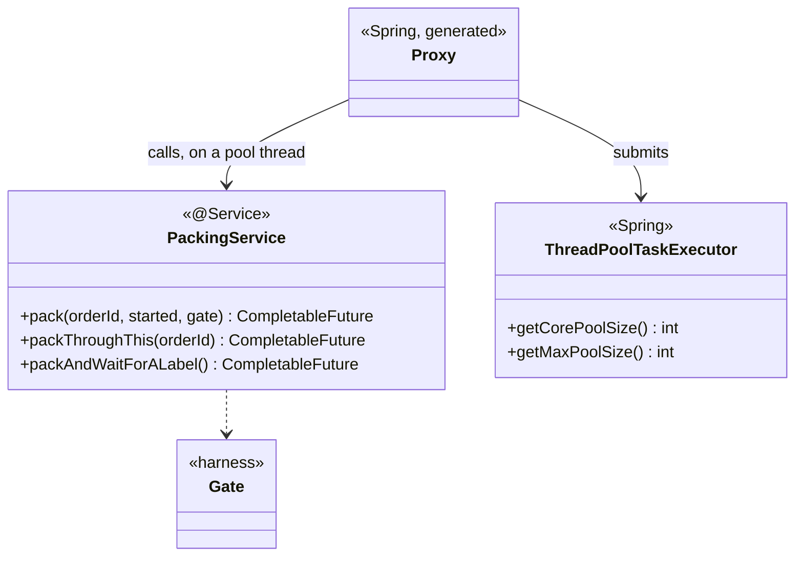

# Thread Pool with Spring Pattern — Class Diagram

`PackingService` has `@Async` methods. Spring's proxy sends them to the executor.

Mermaid source

```mermaid
classDiagram
    class PackingService {
        <<@Service>>
        +pack(orderId, started, gate) CompletableFuture
        +packThroughThis(orderId) CompletableFuture
        +packAndWaitForALabel() CompletableFuture
    }
    class ThreadPoolTaskExecutor {
        <<Spring>>
        +getCorePoolSize() int
        +getMaxPoolSize() int
    }
    class Proxy {
        <<Spring, generated>>
    }
    class Gate {
        <<harness>>
    }
    Proxy --> PackingService : calls, on a pool thread
    Proxy --> ThreadPoolTaskExecutor : submits
    PackingService ..> Gate
```

