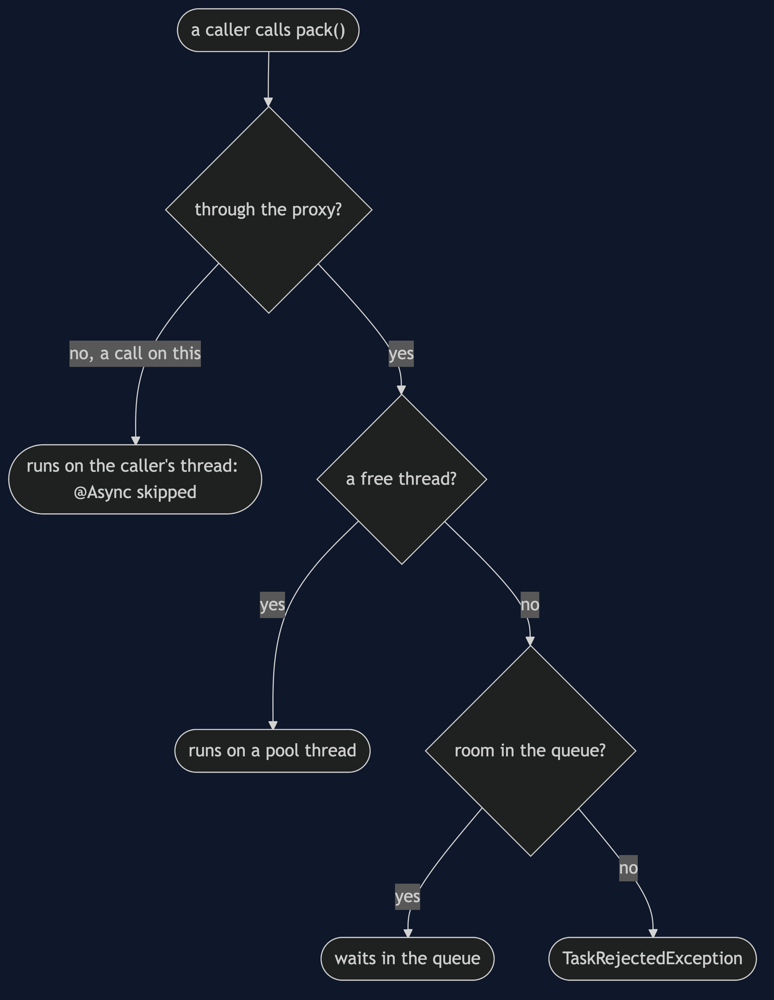
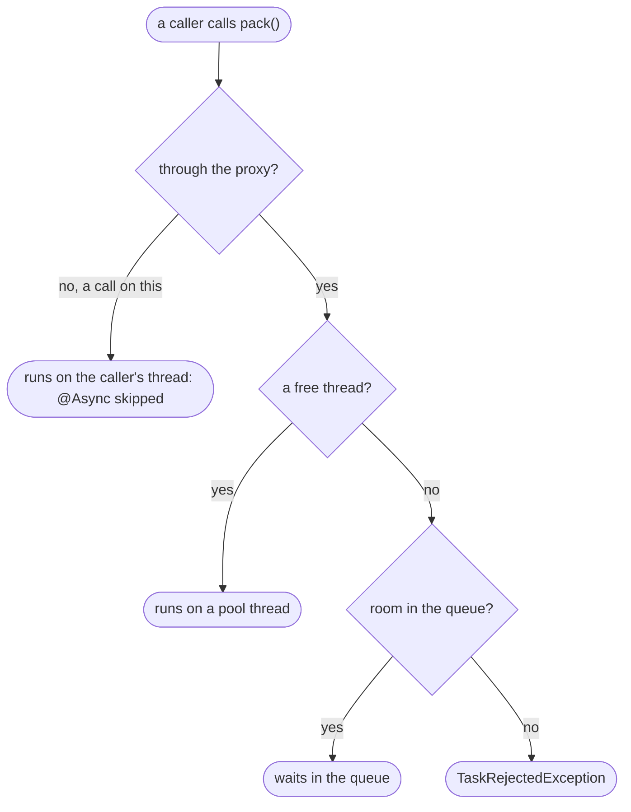

# Thread Pool with Spring Pattern — Data Flow Diagram

One @Async call: run, wait in the queue, or be refused.

Mermaid source

```mermaid
flowchart TD
    Call(["a caller calls pack()"])
    Via{"through the proxy?"}
    Same(["runs on the caller's thread: @Async skipped"])
    Free{"a free thread?"}
    Run(["runs on a pool thread"])
    Room{"room in the queue?"}
    Wait(["waits in the queue"])
    Refuse(["TaskRejectedException"])
    Call --> Via
    Via -- no, a call on this --> Same
    Via -- yes --> Free
    Free -- yes --> Run
    Free -- no --> Room
    Room -- yes --> Wait
    Room -- no --> Refuse
```

