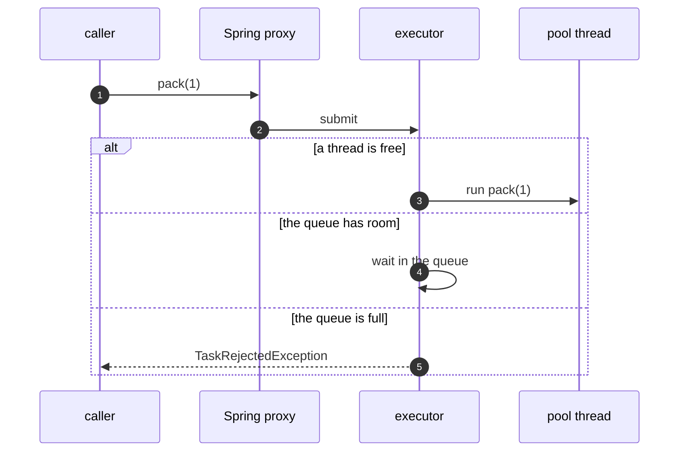

# Thread Pool with Spring Pattern — Sequence Diagram

Written for a listener with the screen off.

Say it in words. A caller calls the packing method. What it holds is not the service but a proxy Spring generated. The proxy does not run the method. It hands the call to the executor. If a thread is free, the call runs there. If not, it waits in the queue, and if the queue is full, the caller gets a task rejected exception. The caller gets back a completable future, and the work happens somewhere else.

Mermaid source

The load-bearing sentence: **the caller holds a proxy, and the work happens somewhere else.**
