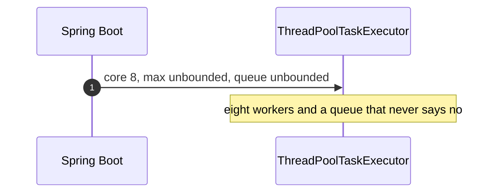
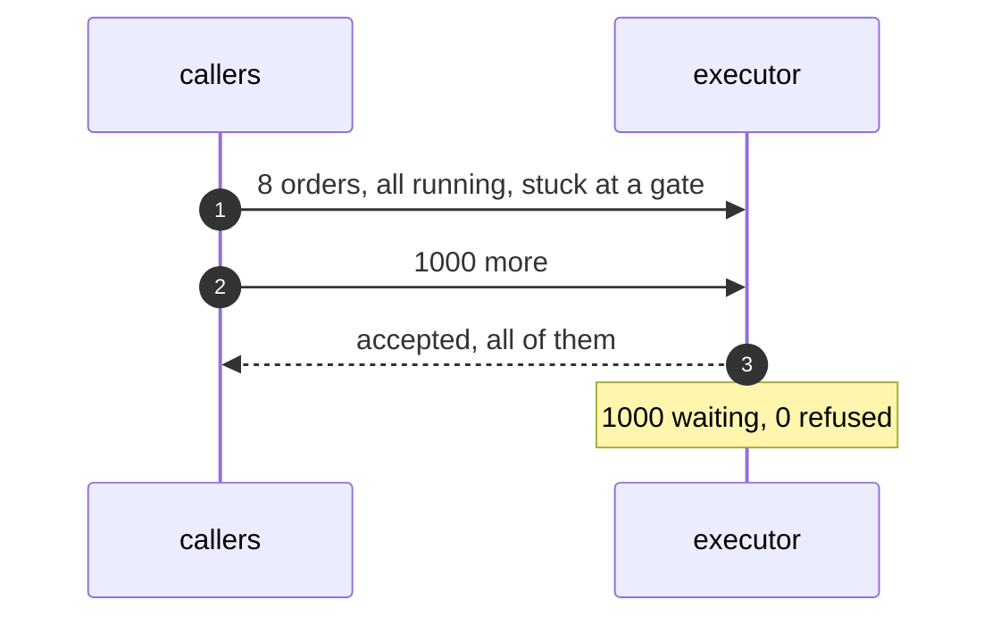
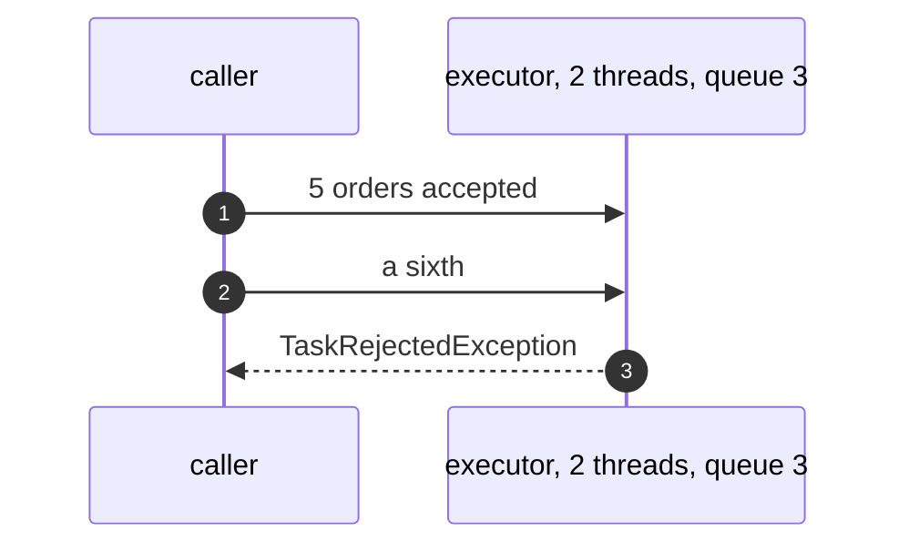
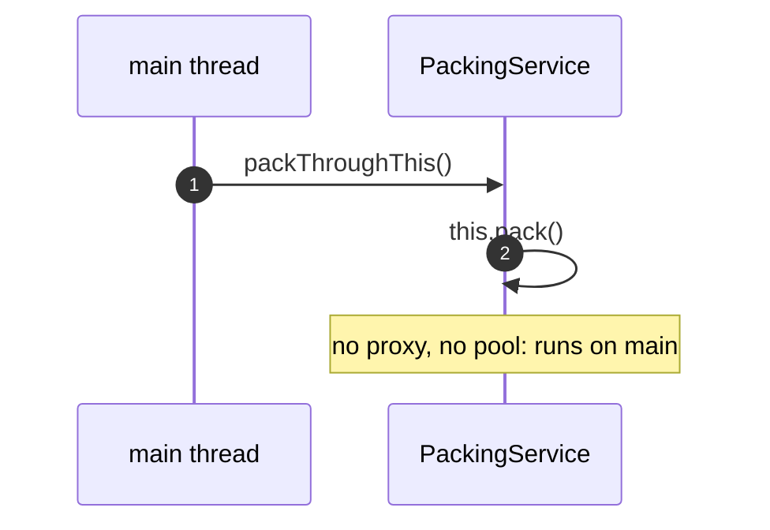

# Thread Pool with Spring Pattern — UML Sequence Diagrams

Four sequences.

## 1. The Default Executor

Mermaid source

## 2. A Backlog

Mermaid source

## 3. A Refusal

Mermaid source

## 4. A Call On This

Mermaid source

