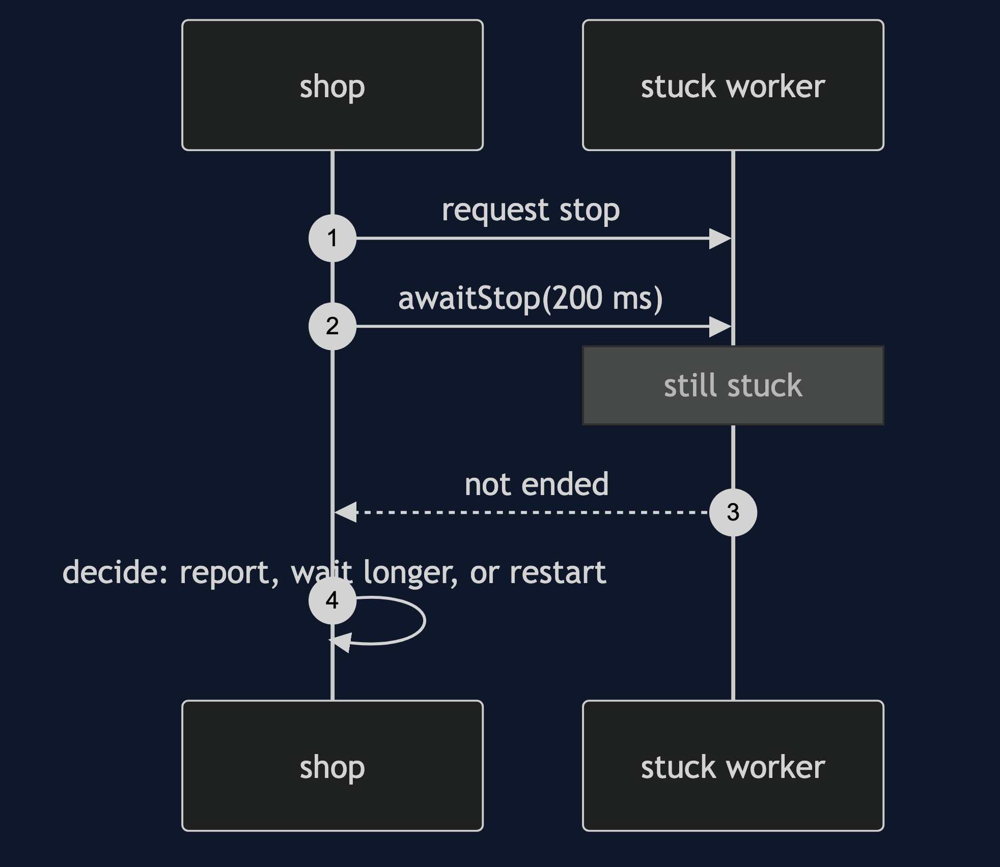

# Two-Phase Termination Pattern

```
src/main/java/com/jk/explore/twophase/
├── TwoPhaseDemo.java                the six acts
├── Worker.java                      writes orders; requestStop() then awaitStop()
├── Ledger.java                      notes if it was left with an order half written
└── Gate.java
```

**Two-phase termination: ask the thread to stop, let it finish and tidy up, then wait, with a limit.**

This project is in [concurrency-design-patterns](..). It is the shutdown that [Thread Pool](../thread-pool-pattern) and [Guarded Suspension](../guarded-suspension-pattern) both need, and the reason `ExecutorService` has `shutdown` and `awaitTermination` as two separate calls.

## Run

```bash
./gradlew run
```

Six acts. Every number quoted below comes from this program's own output.

```
ONE. Pull the plug.
  the shop shuts down and closes the ledger while ORD-1 is half written. lines written: [ORD-1 line 1].
  left with an order half written: true. the order has a line 1 and no line 2 or 3.
TWO. Ask it to stop, and let it finish.
  stop requested while ORD-1 is half written, and ORD-2 is waiting.
  the worker ended: true. orders finished: 1. lines: 3, all of ORD-1's, none of ORD-2's.
  left with an order half written: false.
THREE. A worker that is asleep.
  a stop request that only sets a flag, to a worker waiting for an order: false, still WAITING.
  the same request, with an interrupt to wake it: true.
FOUR. Tidy up on the way out.
  the worker was interrupted while waiting. did its cleanup run: true.
  the cleanup is in a finally block, so it runs however the worker ends.
FIVE. A worker that will not stop.
  the worker is stuck in something that ignores the request. after waiting 200 ms: ended false, alive true.
  phase two has a time limit. what happens next is a decision: report it, wait longer, or restart the process. Java gives no safe way to force a thread to stop.
SIX. The bill.
  stopped with 5 orders still waiting: finished 1, pending 5.
  those 5 orders were accepted from customers and have not been done. a stop needs a policy: finish them first, hand them to another worker, or save them.
  and shutting down took as long as the order in progress. stopping is never instant.
```

## Test

```bash
./gradlew test
```

2 test classes, 7 test methods, offline, with nothing installed and no framework.

## Technologies and versions

| What | Version | Why it is here |
| --- | --- | --- |
| Java | 21 | The repository standard, via the Gradle toolchain block |
| Gradle | 9.2.1 | The wrapper in this directory; no separate install needed |
| JUnit 5 | 5.10.2 | Test runner |

No framework. A hand-built project stays plain Java so the mechanism is the whole lesson.

## Learning Material

| Document | What it covers |
| --- | --- |
| [`docs/problem-statement.md`](docs/problem-statement.md) | The scenario, and the problem |
| [`docs/two-phase-termination-pattern-explained.md`](docs/two-phase-termination-pattern-explained.md) | The pattern, and six acts |
| [`docs/class-diagram.md`](docs/class-diagram.md) | The types |
| [`docs/architecture-diagram.md`](docs/architecture-diagram.md) | The parts and how they connect |
| [`docs/data-flow-diagram.md`](docs/data-flow-diagram.md) | What happens to one request |
| [`docs/sequence-diagram.md`](docs/sequence-diagram.md) | Written for a listener with the screen off |
| [`docs/uml-diagram.md`](docs/uml-diagram.md) | Four sequences |
| [`docs/animation.html`](docs/animation.html) | The six acts in a browser |
| [`docs/prerequisites.md`](docs/prerequisites.md) | What you need to know |
| [`docs/session.md`](docs/session.md) | A one-hour taught session |
| [`docs/spec.md`](docs/spec.md) | The generated specification |
| [`docs/youtube.md`](docs/youtube.md) | Title, description and chapters |

### The pattern in one picture


### Where each piece sits


### How one request moves


### Who calls whom, in order


### All four sequences




### Video

Built from [`video/scenes.py`](video/scenes.py) by
[`video/build_video.sh`](video/build_video.sh). The rendered file is not
committed; see the repository README for why.

## Where you have already met this

`ExecutorService`'s shutdown and awaitTermination, Spring's graceful shutdown, and Kubernetes sending a stop signal and then a kill after a grace period.

## When this is too much

For a thread that holds no state and whose work can be repeated, stopping at once is fine, and a daemon thread can simply be left. The pattern matters where a stop can damage something.

## Where this sits

This project is in [`concurrency-design-patterns`](..), and is meant to be read with its neighbours there.
