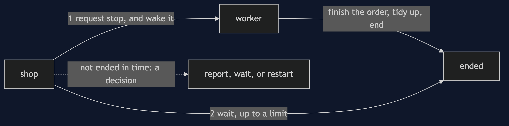
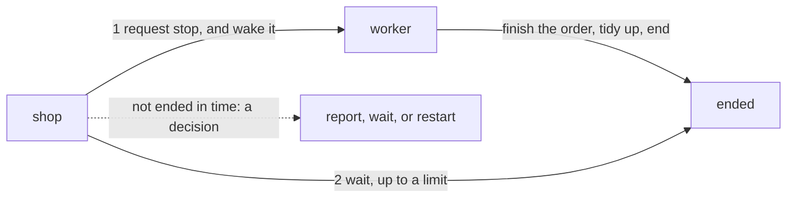

# Two-Phase Termination Pattern — Architecture Diagram

The shop asks; the worker finishes and ends; the shop waits, with a limit.

Mermaid source

```mermaid
flowchart LR
    S["shop"] -->|1 request stop, and wake it| W["worker"]
    W -->|finish the order, tidy up, end| E["ended"]
    S -->|2 wait, up to a limit| E
    S -.->|not ended in time: a decision| D["report, wait, or restart"]
```

