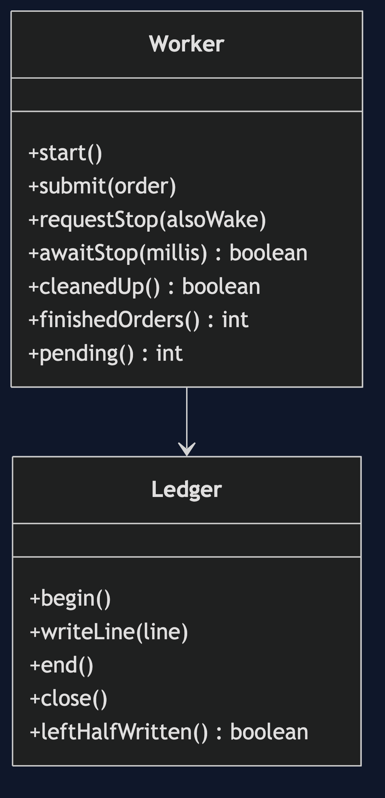
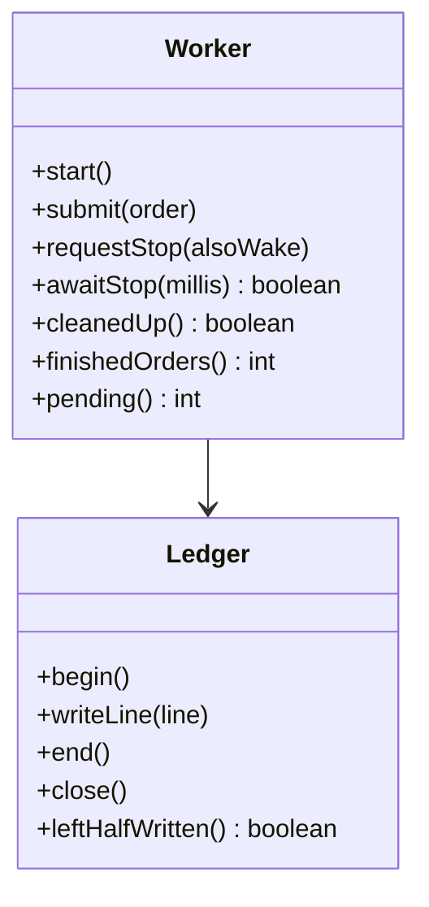

# Two-Phase Termination Pattern — Class Diagram

A worker that can be asked to stop, and waited for.

Mermaid source

```mermaid
classDiagram
    class Worker {
        +start()
        +submit(order)
        +requestStop(alsoWake)
        +awaitStop(millis) boolean
        +cleanedUp() boolean
        +finishedOrders() int
        +pending() int
    }
    class Ledger {
        +begin()
        +writeLine(line)
        +end()
        +close()
        +leftHalfWritten() boolean
    }
    Worker --> Ledger
```

