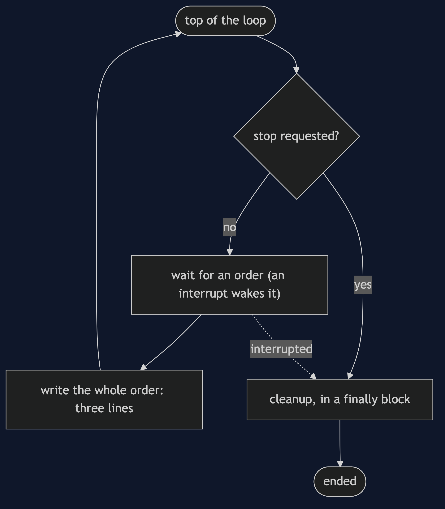
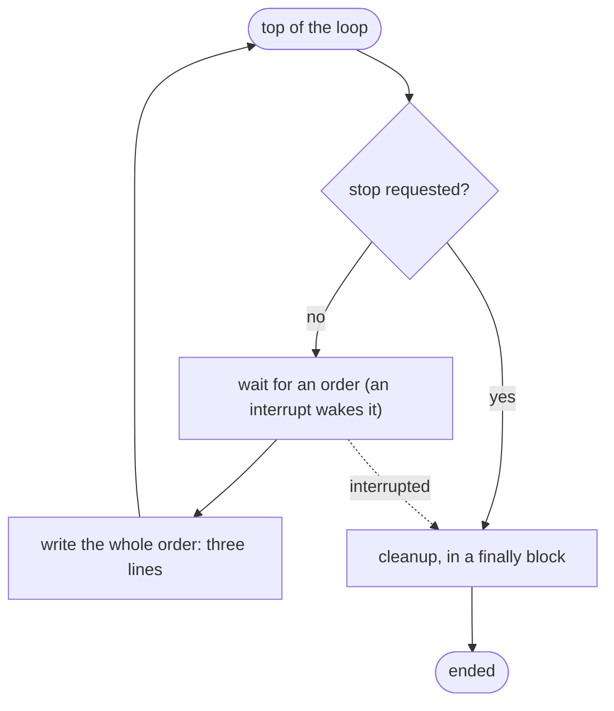

# Two-Phase Termination Pattern — Data Flow Diagram

What the worker does in its loop.

Mermaid source

```mermaid
flowchart TD
    Top(["top of the loop"])
    Asked{"stop requested?"}
    Wait["wait for an order (an interrupt wakes it)"]
    Do["write the whole order: three lines"]
    Clean["cleanup, in a finally block"]
    End(["ended"])
    Top --> Asked
    Asked -- yes --> Clean --> End
    Asked -- no --> Wait --> Do --> Top
    Wait -. interrupted .-> Clean
```

