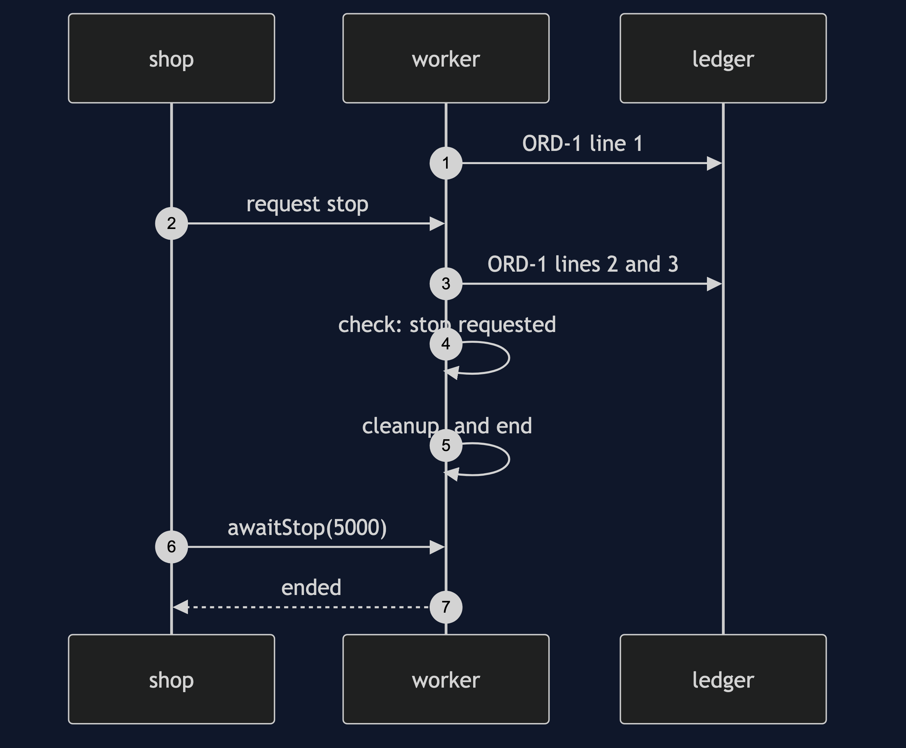
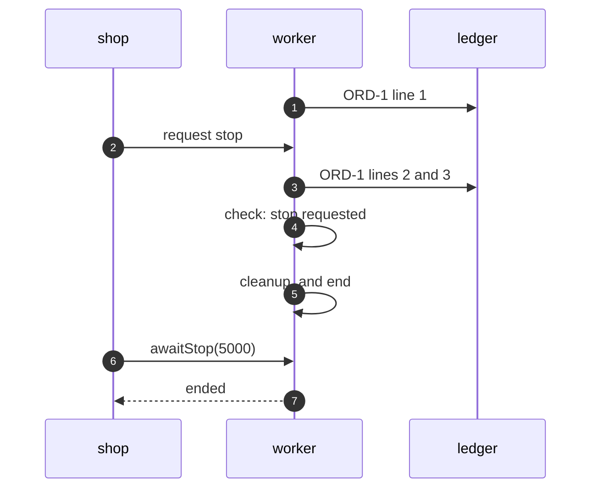

# Two-Phase Termination Pattern — Sequence Diagram

Written for a listener with the screen off.

Say it in words. The shop tells the worker to stop. The worker is in the middle of order one, having written line one. It carries on, writes lines two and three, and ends the order. At the top of the loop it checks the request, finds it, and does not start order two. It runs its cleanup and ends. The shop, which has been waiting up to five seconds, sees the worker has ended.

Mermaid source

The load-bearing sentence: **the worker finishes the unit of work before it ends.**
