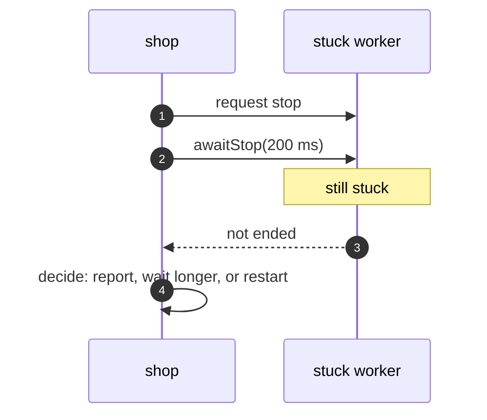

# Two-Phase Termination Pattern — UML Sequence Diagrams

Four sequences.

## 1. A Stop That Times Out

Mermaid source

```mermaid
sequenceDiagram
    autonumber
    participant S as shop
    participant W as stuck worker
    S->>W: request stop
    S->>W: awaitStop(200 ms)
    Note over W: still stuck
    W-->>S: not ended
    S->>S: decide: report, wait longer, or restart
```

