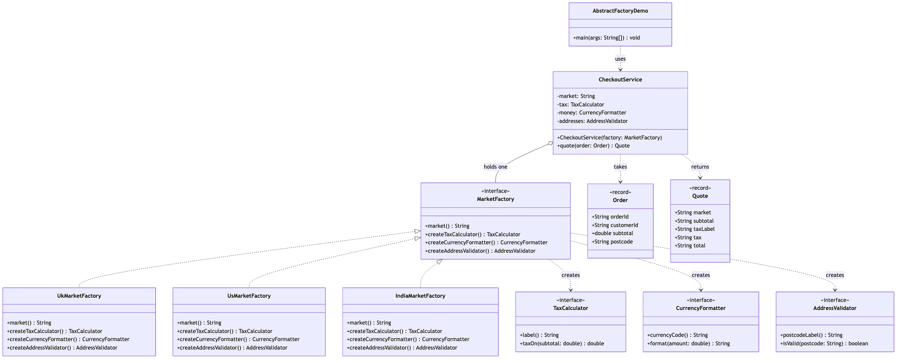
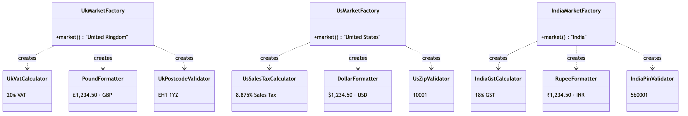

# Abstract Factory Pattern

Demonstrates the **Abstract Factory** creational pattern (Gang of Four) using
an e-commerce checkout that sells into three regional markets.

- `TaxCalculator`, `CurrencyFormatter`, `AddressValidator` — the three
  abstract products. Every market needs one of each, and the three must agree.
- `UkVatCalculator` / `PoundFormatter` / `UkPostcodeValidator`,
  `UsSalesTaxCalculator` / `DollarFormatter` / `UsZipValidator`,
  `IndiaGstCalculator` / `RupeeFormatter` / `IndiaPinValidator` — the nine
  concrete products, arranged as three families.
- `MarketFactory` — the abstract factory. Three creation methods and nothing
  else. It never names a market or a product class.
- `UkMarketFactory`, `UsMarketFactory`, `IndiaMarketFactory` — the concrete
  factories. Each builds one complete, self-consistent family.
- `CheckoutService` — the client. It is handed one factory, collects the three
  products in its constructor, and then works entirely through interfaces.
- `Order` / `Quote` — immutable value objects in and out.
- `AbstractFactoryDemo` — runnable entry point that quotes the same order in
  all three markets, then shows a cross-market order being rejected.

Search `CheckoutService` for "UK", "US" or "India" and you find nothing. That
is the point: a British tax rate cannot end up next to an American ZIP code,
not because anything checks for it, but because no code exists that could
produce it.

## Run

```bash
./gradlew run
```

Which prints:

```text
Checkout: United Kingdom order ORD-3001 to postcode EH1 1YZ
Checkout: VAT of £24.00 on £120.00
Checkout: total £144.00 GBP
Quote: Quote[market=United Kingdom, subtotal=£120.00, taxLabel=VAT, tax=£24.00, total=£144.00]

Checkout: United States order ORD-3001 to ZIP code 10001
Checkout: Sales Tax of $10.65 on $120.00
Checkout: total $130.65 USD
Quote: Quote[market=United States, subtotal=$120.00, taxLabel=Sales Tax, tax=$10.65, total=$130.65]

Checkout: India order ORD-3001 to PIN code 560001
Checkout: GST of ₹21.60 on ₹120.00
Checkout: total ₹141.60 INR
Quote: Quote[market=India, subtotal=₹120.00, taxLabel=GST, tax=₹21.60, total=₹141.60]

Rejected: "EH1 1YZ" is not a valid United States ZIP code
```

## Test

```bash
./gradlew test
```

## Learning Material

Start here if you are new to the pattern — the docs are ordered as a learning
path.

| Document | What it covers |
| --- | --- |
| [`docs/prerequisites.md`](docs/prerequisites.md) | What to know and install before you start |
| [`docs/problem-statement.md`](docs/problem-statement.md) | The problem the pattern solves, and why the naive approach hurts |
| [`docs/abstract-factory-pattern-explained.md`](docs/abstract-factory-pattern-explained.md) | The pattern itself, the code walked through, pitfalls, and comparisons |
| [`docs/class-diagram.md`](docs/class-diagram.md) | Static structure, and the three families |
| [`docs/uml-diagram.md`](docs/uml-diagram.md) | Runtime call flow |
| [`docs/animation.html`](docs/animation.html) | Animated, step-by-step walkthrough — open in a browser. Optional narration via the **Narration** button |
| [`docs/session.md`](docs/session.md) | A 60-minute guided session plan for teaching it |
| [`docs/youtube.md`](docs/youtube.md) | Title, description, chapters and thumbnail for publishing the video |
| [`docs/thumbnail.png`](docs/thumbnail.png) | The 1280×720 image to upload as the YouTube thumbnail |
| [`docs/spec.md`](docs/spec.md) | The project specification — problem, code, video and publishing quality bar. Also as [`spec.html`](docs/spec.html) |
| [`video/`](video/) | A narrated ~10 minute video, plus the script and build pipeline |

### The pattern in one picture



### The three families



### Video

`video/abstract-factory-pattern-explained.mp4` — 1080p, ~10 minutes, narrated.
An audio-only version is alongside it. See
[`video/README.md`](video/README.md) to rebuild or re-record it.

### Related

The three factory patterns in this repository are best read in order:

1. [`../simple-factory-pattern`](../simple-factory-pattern) — one helper class
   with a `switch`, choosing one object. Not in the Gang of Four book, but
   where everyone starts.
2. [`../factory-method-pattern`](../factory-method-pattern) — the choice moves
   into the type system. A creator writes a workflow with a hole in it, and
   subclasses fill the hole with one object each.
3. **This project** — the choice moves up a level again. One decision now
   produces a whole matching *set* of objects.

Simple Factory asks "which one?". Factory Method asks "which one — decided by
my subclass?". Abstract Factory asks "which set?".
