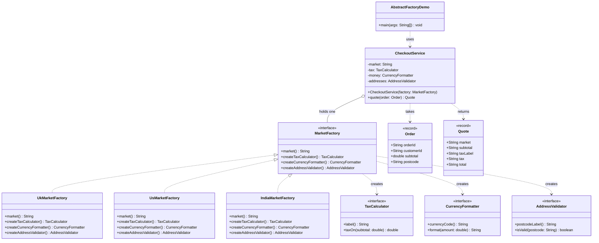
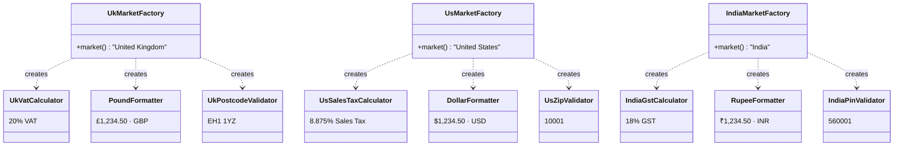

# Abstract Factory Pattern — Class Diagram

Shows the static structure: `CheckoutService` holds one `MarketFactory` and
asks it for three products. Each concrete factory returns the three that
belong to *its* market, so a mismatched set cannot be assembled.

Two pictures, because there are two things to see. The first is the shape of
the pattern; the second is what the families actually contain.

## 1. The roles

Mermaid source

## 2. The three families

Every concrete factory builds one complete row. Nine classes, three families,
and no arrow between the columns.

Mermaid source

The columns line up: every factory produces one tax calculator, one currency
formatter and one address validator, and they all implement the same three
interfaces.

| | `TaxCalculator` | `CurrencyFormatter` | `AddressValidator` |
| --- | --- | --- | --- |
| `UkMarketFactory` | `UkVatCalculator` | `PoundFormatter` | `UkPostcodeValidator` |
| `UsMarketFactory` | `UsSalesTaxCalculator` | `DollarFormatter` | `UsZipValidator` |
| `IndiaMarketFactory` | `IndiaGstCalculator` | `RupeeFormatter` | `IndiaPinValidator` |

## Notes

- `MarketFactory` is the **abstract factory**. It declares one creation method
  per product kind — three here — and nothing else. It is the only type
  `CheckoutService` needs in order to build a whole market's worth of behaviour.
- `UkMarketFactory`, `UsMarketFactory` and `IndiaMarketFactory` are the
  **concrete factories**. Each names three classes, and those three lines are
  the only place in the project where a market's pieces are chosen.
- `TaxCalculator`, `CurrencyFormatter` and `AddressValidator` are the
  **abstract products** — three separate interfaces, which is what distinguishes
  this pattern from Factory Method's single product type.
- The nine classes in the second picture are the **concrete products**. Read the
  table by column and you see three independent hierarchies; read it by row and
  you see three *families*. The pattern is about the rows.
- Follow any `creates` arrow backwards and you land on exactly one factory.
  There is no path by which `UkVatCalculator` and `UsZipValidator` can end up in
  the same `CheckoutService` — not because of a check, but because no code
  exists that could do it.
- `CheckoutService` names no market and no product class. Search it for "UK",
  "US" or "India" and you find nothing; it works entirely through the three
  product interfaces.
- `Order` and `Quote` are immutable `record` value objects. `Quote` holds
  already-formatted strings, so the currency decision made by the factory
  survives all the way out to the caller.
- Compare with `../../factory-method-pattern/docs/class-diagram.md`. There, one
  creator produced one product type through inheritance. Here, one factory
  produces three product types that must agree with each other. Factory Method
  answers "which one?"; Abstract Factory answers "which set?".
