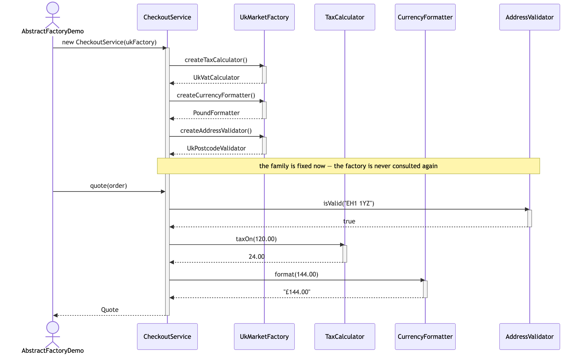
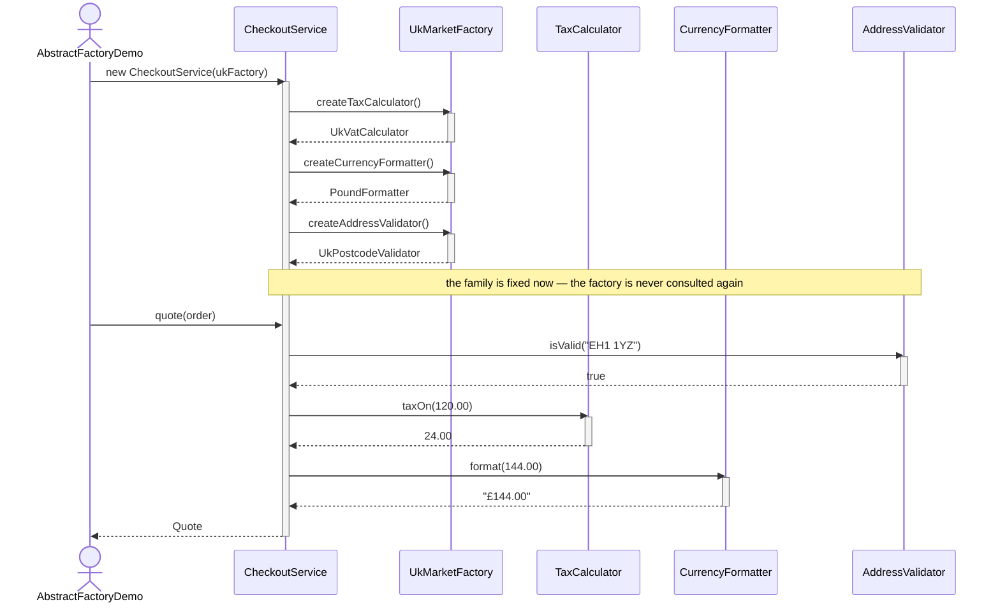

# Abstract Factory Pattern — UML Sequence Diagram

Shows the runtime interaction: the client is handed one factory, collects the
three products from it once, and then talks only to interfaces for the rest of
the run.

Mermaid source

## Notes

- The three creation calls happen once, in the constructor. After that the
  factory has done its job and drops out of the picture entirely — everything
  below the note is interface-to-interface conversation.
- Swap `UkMarketFactory` for `UsMarketFactory` in the very first line and every
  other arrow in this diagram stays exactly as it is. Different objects turn up
  to have the same conversation, and the answers change: `10.65` instead of
  `24.00`, `$130.65` instead of `£144.00`.
- The validator, the calculator and the formatter never talk to each other, yet
  they always agree, because they arrived together. That agreement is the
  guarantee the pattern buys you.
- The address check runs first and throws before anything is printed. The
  message it throws — "not a valid United States ZIP code" — is assembled from
  the products themselves, so it is correct in every market without a single
  branch.
- Compare with `../../factory-method-pattern/docs/uml-diagram.md`. There, one
  creation call happened in the middle of a workflow, each time it ran. Here,
  three creation calls happen up front and set up a consistent world the rest
  of the code lives in.
