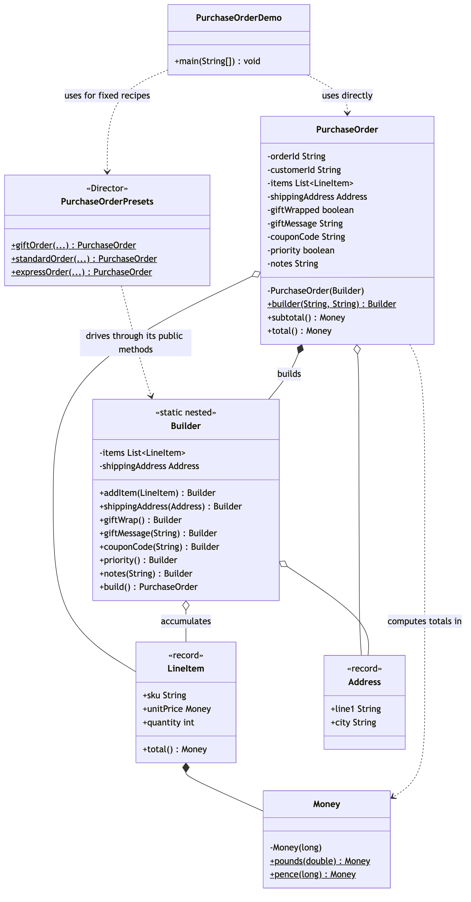
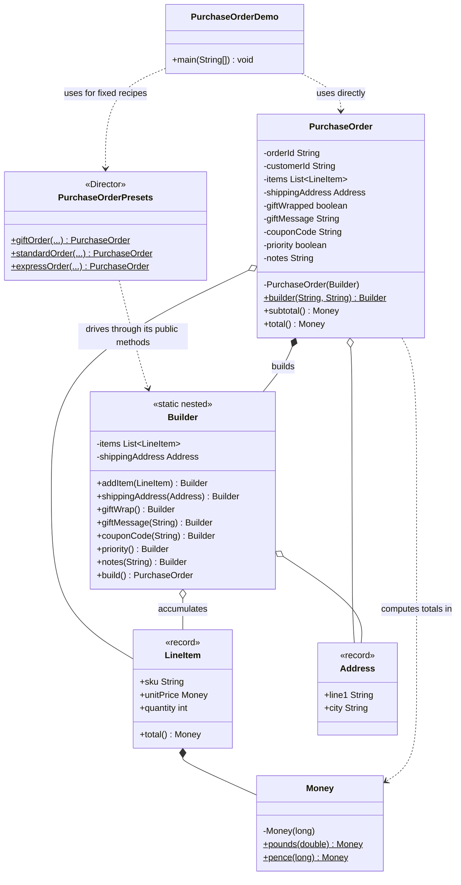
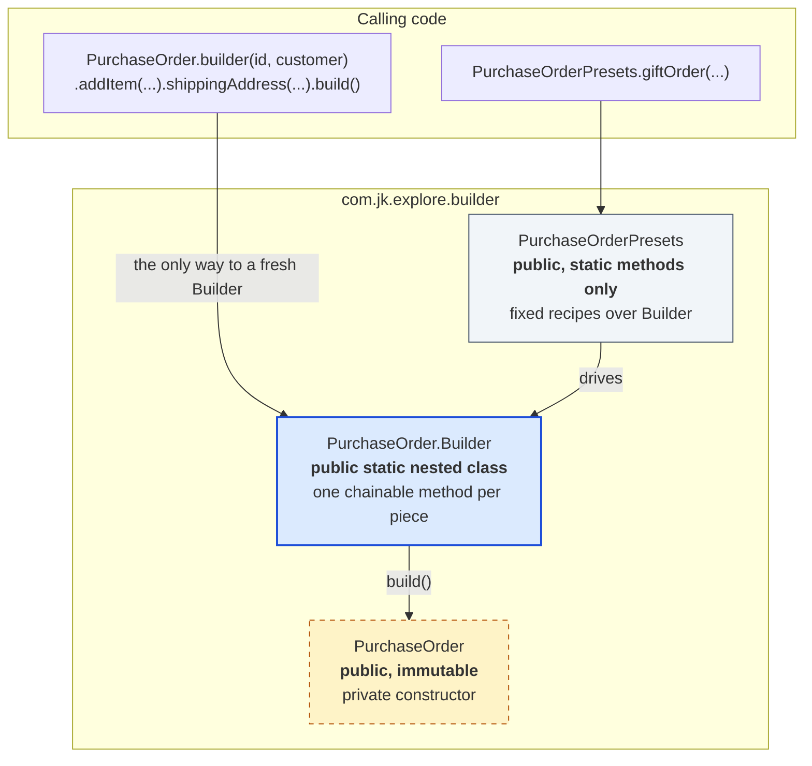

# Builder Pattern — Class Diagram

## The structure

Mermaid source

The arrow to notice is `PurchaseOrderPresets ..> Builder`. It never points
at `PurchaseOrder` directly — the Director-equivalent only ever talks to
the builder's public methods, never to the product's constructor or its
fields. That is what lets `PurchaseOrder` change its private representation
without a single preset needing to change.

## What the caller can see

Mermaid source

`PurchaseOrder`'s constructor is private. There is exactly one door in —
`PurchaseOrder.builder(orderId, customerId)` — and everything downstream of
that door, however many optional pieces get chained on, ends at the same
`build()`.

## Notes

- `LineItem` and `Address` are plain records — two or three required
  fields, nothing to decide, so a constructor is the right tool for them.
  The contrast with `PurchaseOrder`, which has the same kind of required
  data plus five independent optional pieces, is deliberate.
- Compare with
  [`../../abstract-factory-pattern/docs/class-diagram.md`](../../abstract-factory-pattern/docs/class-diagram.md).
  There, one choice produces a *family* of different objects. Here, one
  sequence of choices produces *one* object with many possible shapes.
