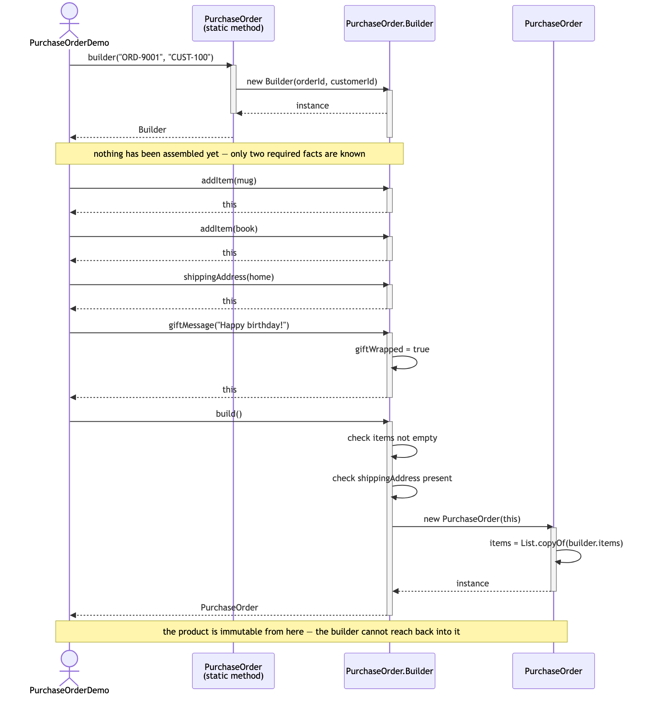
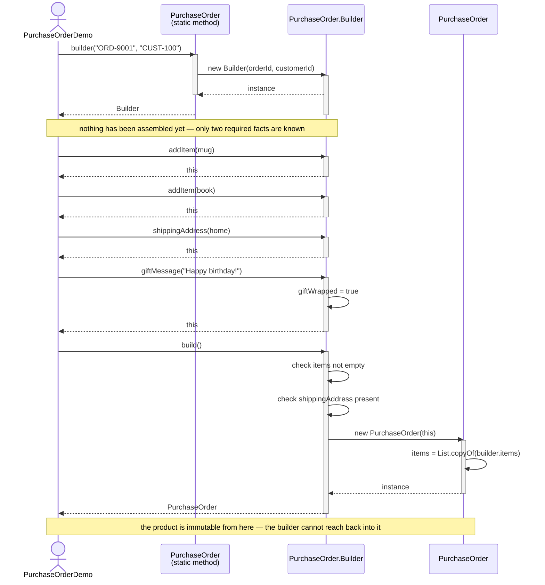

# Builder Pattern — UML Sequence Diagram

Shows the runtime flow: a chain of calls fills in a builder one piece at a
time, and only the final `build()` call produces an object.

Mermaid source

## Notes

- Every arrow from the client to the builder before `build()` returns
  `this` — that is the whole mechanism that lets the calls chain onto one
  statement.
- Nothing is validated until `build()`. `addItem` and `shippingAddress` and
  `giftMessage` cannot know whether the caller intends to call any of the
  others, so the two required checks — at least one item, a shipping
  address — wait until the caller declares itself finished.
- Swap the last few calls for `PurchaseOrderPresets.giftOrder(...)` and the
  diagram grows one participant — the preset sits between the client and
  the builder, making the same `addItem` / `shippingAddress` /
  `giftMessage` calls itself — but the shape below that point, from
  `build()` onward, is identical.
- Compare with
  [`../../static-factory-pattern/docs/uml-diagram.md`](../../static-factory-pattern/docs/uml-diagram.md).
  There, one call produces the finished object in a single round trip. Here,
  the round trip is deliberately spread across several calls, because the
  whole point is that the caller does not have to know the final shape of
  the object on the first line.
