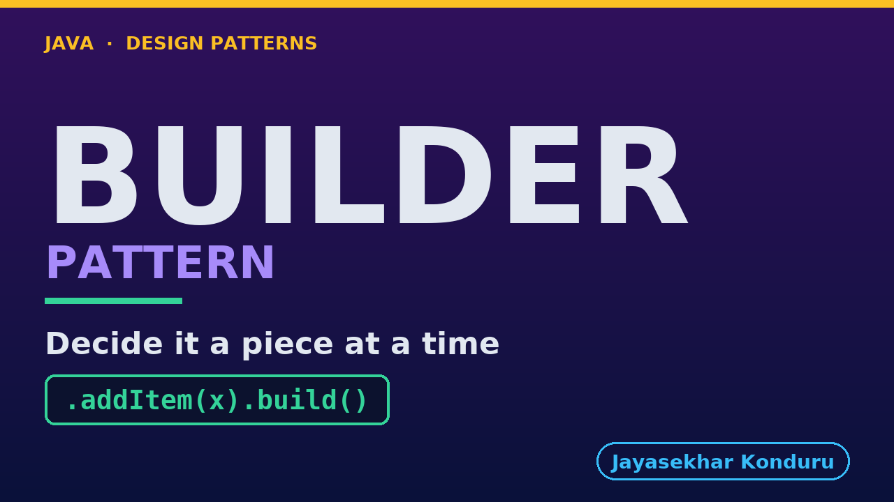

# YouTube — Builder Pattern

Everything needed to publish `video/builder-pattern-explained.mp4`. Copy the fields straight out of this file.

Chapter timings are generated from the video's `.srt`. Re-run `python3 docs/make_youtube_docs.py builder` after any change to the narration, or they will be wrong.

## Title

```
Builder Pattern in Java - Building a Purchase Order
```

51 characters — under the 60 YouTube shows before truncating in search results.

## Description

The first two lines are what a viewer sees above the fold, so they carry the hook rather than the boilerplate.

```
Learn the builder pattern in Java 21 — a Gang of Four pattern *and* item two of Effective Java, described from two angles. We start from a nine-parameter constructor that no one can read at the call site, watch the telescoping-constructor workaround make it worse, and rebuild the same purchase order as a chain of named calls that only gets checked for completeness when build() is called. We cover the Director role, honestly compared to how idiomatic Java actually writes it, and show builder composing with the static factory method rather than competing with it. No prior design-pattern knowledge needed. Full source code and written notes are in the repository.

CHAPTERS
00:00 Introduction
00:57 The Job
01:26 The Constructor With Nine Parameters
01:51 Telescoping Constructors
02:22 Why That Hurts
03:08 The Builder Pattern
03:49 A Made-to-Order Sandwich Counter
04:27 The Shape of It
05:02 Required Facts, Optional Pieces
05:30 One Method, One Piece
05:58 A Rule That Lives in One Place
06:23 Checked Only When You Say You're Done
06:48 The Product Stops Watching the Builder
07:14 The Director, the Java Way
07:49 Running It
08:21 Where It Stops
09:10 How It Relates to the Others
09:53 One Sentence to Keep
10:23 Thanks for Watching

SOURCE CODE, WRITTEN NOTES AND AN INTERACTIVE ANIMATION
https://github.com/jk-boot-up/java-design-patterns/tree/main/gradle-java/creational/builder-pattern

WHAT YOU NEED FIRST
Java 21 and a working knowledge of classes and interfaces. No prior design-pattern knowledge is assumed. The full prerequisites are in docs/prerequisites.md in the repository.
```

## Chapters

YouTube renders these as chapters only if there are at least three and the first is at `00:00`.

```
00:00 Introduction
00:57 The Job
01:26 The Constructor With Nine Parameters
01:51 Telescoping Constructors
02:22 Why That Hurts
03:08 The Builder Pattern
03:49 A Made-to-Order Sandwich Counter
04:27 The Shape of It
05:02 Required Facts, Optional Pieces
05:30 One Method, One Piece
05:58 A Rule That Lives in One Place
06:23 Checked Only When You Say You're Done
06:48 The Product Stops Watching the Builder
07:14 The Director, the Java Way
07:49 Running It
08:21 Where It Stops
09:10 How It Relates to the Others
09:53 One Sentence to Keep
10:23 Thanks for Watching
```

## Tags

```
builder pattern, fluent api java, telescoping constructor, design patterns, java design patterns, gang of four, java 21, software design, clean code, object oriented design, java tutorial, ecommerce, programming tutorial
```

220 characters, under YouTube's 500 limit.

## Thumbnail



**Upload `docs/thumbnail.png`** — 1280×720, the size YouTube recommends, generated by `docs/make_thumbnails.py`. It is deliberately not the same image as the video's opening frame: a thumbnail is judged at about 360 pixels wide in a search result, so this one carries only the pattern name, one line of promise and one short piece of code, each set large enough to survive the shrink.

`video/poster.png` is the 1920×1080 opening frame, produced by the video build. It stays in the repository as the title card; it is not what gets uploaded.

YouTube will not pick the thumbnail up on its own — upload it under **Details → Thumbnail → Upload file**. A custom thumbnail requires a verified channel.

## Upload checklist

- [ ] Upload `video/builder-pattern-explained.mp4` (1080p, H.264, 30 fps, AAC 48 kHz — already YouTube's recommended settings, no re-encode needed)
- [ ] Set the video language to **English** first, or the subtitle option may not appear
- [ ] Add subtitles: *Video elements → Add subtitles → Upload file → With timing* → `video/builder-pattern-explained.srt`
- [ ] Upload `docs/thumbnail.png` as the thumbnail — do not let YouTube auto-pick a frame
- [ ] Paste the title, description and tags from above
- [ ] Add to the **Java Design Patterns** playlist, in learning order
- [ ] Wait for 1080p processing before sharing the link — code slides are unreadable at 360p

## Cards and end screen

End screen links to **Prototype Pattern**, the next video in the learning order.

Add a card partway through pointing at the playlist, so a viewer who arrives at this pattern from search can find the rest of the series.

## Runtime

Approximately 10:49, narrated at 145 words per minute.
