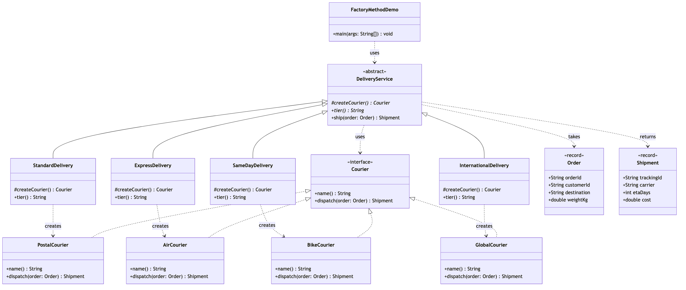

# Factory Method Pattern

Demonstrates the **Factory Method** creational pattern (Gang of Four) using
e-commerce delivery tiers as an example.

- `Courier` — the product interface every carrier implements.
- `PostalCourier`, `AirCourier`, `BikeCourier`, `GlobalCourier` — the
  concrete products, each with its own speed, pricing and tracking prefix.
- `DeliveryService` — the abstract creator. It owns `ship(...)`, the workflow
  every tier shares, and declares the **factory method** `createCourier()`
  that subclasses must fill in. It never names a courier class.
- `StandardDelivery`, `ExpressDelivery`, `SameDayDelivery`,
  `InternationalDelivery` — the concrete creators. Six lines each: pick a
  courier, name the tier.
- `Order` / `Shipment` — simple value objects passed to and returned from a
  courier.
- `FactoryMethodDemo` — runnable entry point that ships the same order four
  different ways.

There is no `switch` and no `if` on a tier name anywhere in this project.
That is the point: adding a fifth tier means adding a file, never editing
one.

## Run

```bash
./gradlew run
```

Which prints:

```text
Standard: preparing ORD-2001 for Edinburgh via Royal Post
Royal Post: dropping ORD-2001 into the postal network
Standard: booked RP-FB66A083, arriving in 5 day(s)
Shipment: Shipment[trackingId=RP-FB66A083, carrier=Royal Post, etaDays=5, cost=5.24]

Express: preparing ORD-2001 for Edinburgh via SkyLink Air
SkyLink Air: booking ORD-2001 onto tonight's flight
Express: booked SL-3B5DD59E, arriving in 2 day(s)
Shipment: Shipment[trackingId=SL-3B5DD59E, carrier=SkyLink Air, etaDays=2, cost=15.5]

Same Day: preparing ORD-2001 for Edinburgh via CityRide Bikes
CityRide Bikes: assigning a rider to ORD-2001 right now
Same Day: booked CR-B42EC524, arriving in 0 day(s)
Shipment: Shipment[trackingId=CR-B42EC524, carrier=CityRide Bikes, etaDays=0, cost=8.75]

International: preparing ORD-2001 for Edinburgh via TransWorld Freight
TransWorld Freight: filing customs papers for ORD-2001
TransWorld Freight: handing over to the destination carrier in Edinburgh
International: booked TW-FAC23427, arriving in 9 day(s)
Shipment: Shipment[trackingId=TW-FAC23427, carrier=TransWorld Freight, etaDays=9, cost=29.25]
```

The identifiers are generated per run, so the transaction, order and
tracking codes differ each time; everything else is stable.

## Test

```bash
./gradlew test
```

## Learning Material

Start here if you are new to the pattern — the docs are ordered as a
learning path.

| Document | What it covers |
| --- | --- |
| [`docs/prerequisites.md`](docs/prerequisites.md) | What to know and install before you start |
| [`docs/problem-statement.md`](docs/problem-statement.md) | The problem the pattern solves, and why the naive approach hurts |
| [`docs/factory-method-pattern-explained.md`](docs/factory-method-pattern-explained.md) | The pattern itself, the code walked through, pitfalls, and comparisons |
| [`docs/class-diagram.md`](docs/class-diagram.md) | Static structure |
| [`docs/uml-diagram.md`](docs/uml-diagram.md) | Runtime call flow |
| [`docs/animation.html`](docs/animation.html) | Animated, step-by-step walkthrough — open in a browser. Optional narration via the **Narration** button |
| [`docs/session.md`](docs/session.md) | A 60-minute guided session plan for teaching it |
| [`docs/youtube.md`](docs/youtube.md) | Title, description, chapters and thumbnail for publishing the video |
| [`docs/thumbnail.png`](docs/thumbnail.png) | The 1280×720 image to upload as the YouTube thumbnail |
| [`docs/spec.md`](docs/spec.md) | The project specification — problem, code, video and publishing quality bar. Also as [`spec.html`](docs/spec.html) |
| [`video/`](video/) | A narrated ~8 minute video, plus the script and build pipeline |

### The pattern in one picture



### Video

`video/factory-method-pattern-explained.mp4` — 1080p, ~8 minutes, narrated.
An audio-only version is alongside it. See
[`video/README.md`](video/README.md) to rebuild or re-record it.

### Related

[`../simple-factory-pattern`](../simple-factory-pattern) — the simpler idiom
this pattern grows out of. Both decide *what gets built*; Simple Factory
does it with a `switch` in one class, Factory Method does it with
inheritance. Reading them back to back is the fastest way to see why the
Gang of Four bothered.
