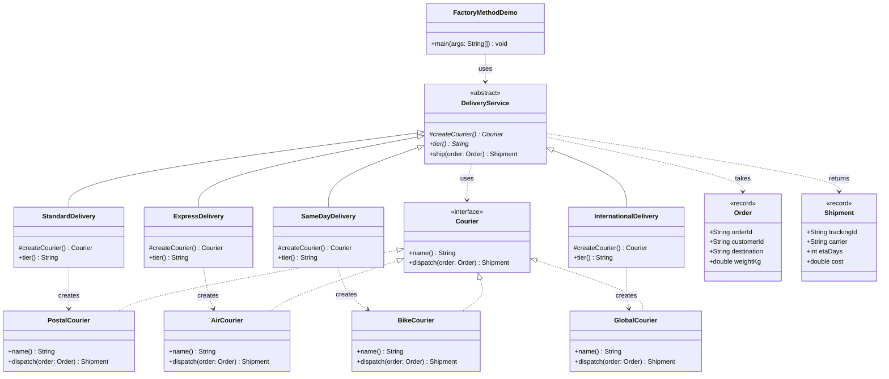

# Factory Method Pattern — Class Diagram

Shows the static structure: `DeliveryService` runs the whole shipping
workflow while knowing nothing but the `Courier` interface. Each subclass
answers one question — which courier — by overriding `createCourier()`.

Mermaid source

## Notes

- `DeliveryService` is the **creator**. It owns `ship(...)`, the workflow every
  tier shares, and declares `createCourier()` as an abstract hole in the middle
  of that workflow. It never names a concrete courier class.
- `createCourier()` is the **factory method** itself — one abstract method, not
  a class. That is the whole pattern.
- `StandardDelivery`, `ExpressDelivery`, `SameDayDelivery` and
  `InternationalDelivery` are the **concrete creators**. Each is a handful of
  lines: pick a courier, name the tier. Nothing else.
- `Courier` is the **product interface** and the four courier classes are the
  **concrete products**. Unlike the sibling Simple Factory project, `Courier` is
  deliberately *not* `sealed`: this pattern exists so new products can arrive
  from anywhere, including other packages and other jars.
- Look for a `switch` in this diagram and you will not find one. Compare the
  arrows with `../../simple-factory-pattern/docs/class-diagram.md`: there, every
  `creates` arrow leaves one central factory class; here they leave four
  independent subclasses. That difference is why adding a fifth tier means
  adding a file rather than editing one.
- `ship(...)` is `final`. Subclasses change *which* courier is used, never the
  steps around it — the guard, the log lines, the order of operations.
- `Order` and `Shipment` are immutable `record` value objects passed to and
  returned from a courier.
