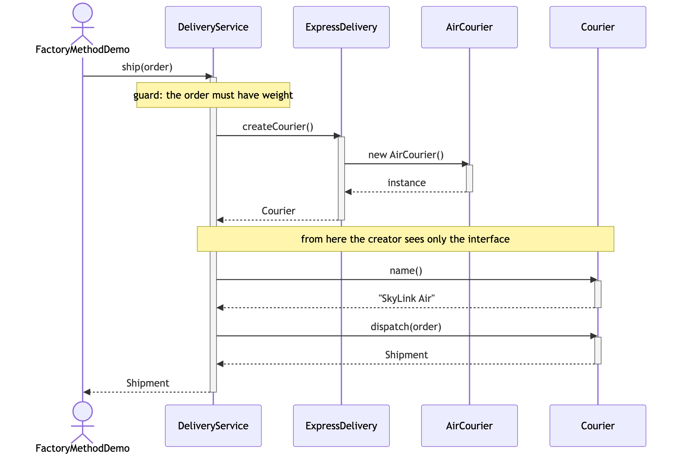
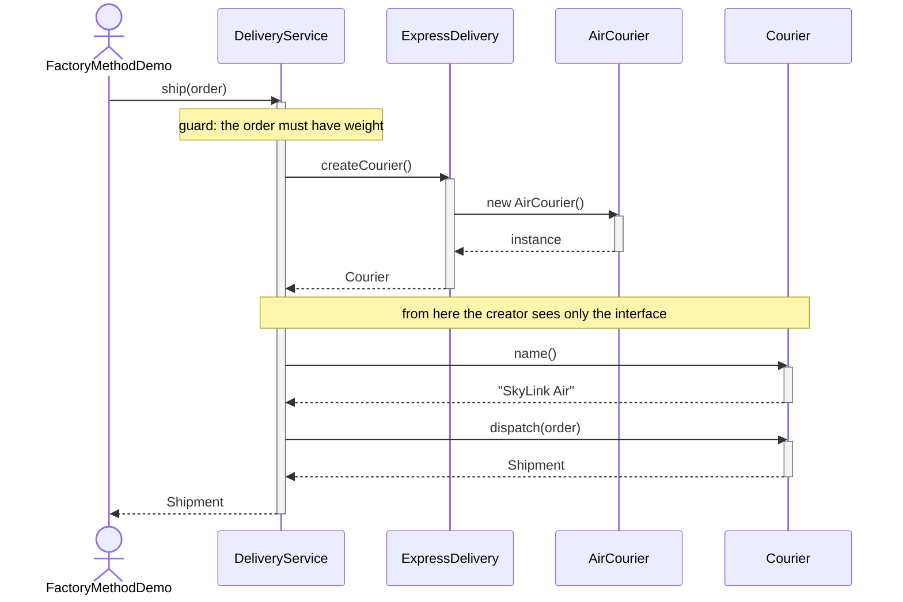

# Factory Method Pattern — UML Sequence Diagram

Shows the runtime interaction: the client calls `ship(...)` on a creator, and
the creator calls its own factory method to get a courier before running the
rest of the workflow.

Mermaid source

## Notes

- The call to `createCourier()` goes *down* into the subclass and comes back
  up. `DeliveryService` wrote the call; `ExpressDelivery` decides what it
  returns. That inversion is the whole trick, and it is why the pattern is
  sometimes described as "a hook in the middle of an algorithm".
- `ship(...)` is a single method with three phases: the shared guard, the
  factory-method call, and the shared logging around `dispatch(...)`. Only the
  middle phase varies by subclass.
- Swap `ExpressDelivery` for `SameDayDelivery` and every arrow in this diagram
  is identical apart from which class is constructed. The conversation does not
  change — a different object shows up to have it.
- Compare with `../../simple-factory-pattern/docs/uml-diagram.md`. There, the
  client asks a static factory *sideways* for an object. Here, the creator asks
  *itself*, and inheritance supplies the answer. No static call, no enum, no
  `switch`.
