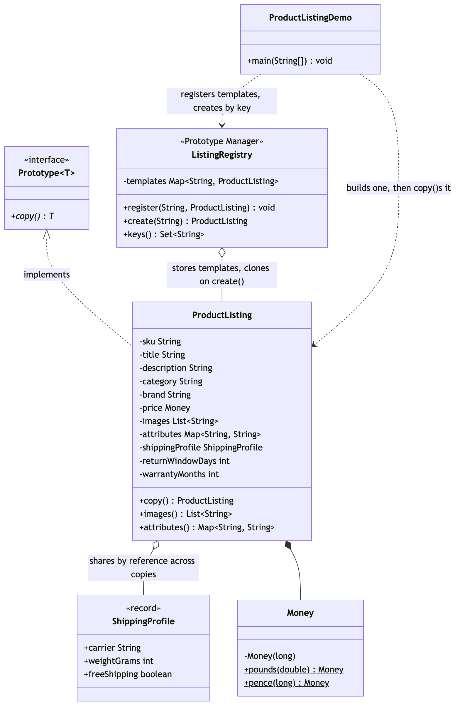

# Prototype Pattern

Demonstrates the **prototype pattern** — a Gang of Four creational pattern —
using a marketplace product listing that is expensive to assemble once and
needed in several near-identical variants.

It deliberately avoids Java's built-in `Cloneable`/`Object.clone()`, which
*Effective Java* Item 13 spends a chapter warning against: a protected method
that has to be re-exposed, a checked exception that can never fire, and a
shallow copy by default. This project defines its own `Prototype<T>`
interface instead, with a plain `copy()` method.

- `Prototype<T>` — a one-method interface: `T copy()`. No `Cloneable`
  baggage, no default implementation, because only the concrete type knows
  which of its own fields need a real copy and which can be shared.
- `ProductListing` — the concrete prototype. Mutable on purpose — a
  prototype is a working draft you clone and tweak. Its `copy()` method has
  no copying logic of its own; it just calls the constructor again, which
  already deep-copies `images` and `attributes` into a fresh `ArrayList` and
  `LinkedHashMap` for any caller. `shippingProfile`, an immutable record, is
  passed straight through and shared by reference across every copy.
- `ShippingProfile` — an immutable record (carrier, weight, free shipping),
  safe to share because nothing can mutate it.
- `Money` — the same value type from the static-factory-pattern and
  builder-pattern projects, reused here for listing prices.
- `ListingRegistry` — the GoF's own named variant of Prototype, sometimes
  called a Prototype Manager: a runtime-keyed shelf of templates that hands
  back a fresh `copy()` for a given key, so a caller never needs to know how
  a template was originally assembled.
- `ProductListingDemo` — runnable entry point: one master listing, a clone
  tweaked into a different variant, proof the master's mutable collections
  are untouched, proof the shared `ShippingProfile` really is the same
  instance, and a `ListingRegistry` handing back independent clones by key.

The point in one line: when you already have one fully-assembled object and
need another that's almost the same, copy it instead of rebuilding it from
scratch — and decide, field by field, what "copy" should mean.

## Run

```bash
./gradlew run
```

Which prints:

```text
Master:      ProductListing{sku=EARBUD-BLK, title=Wireless Earbuds, price=£59.99, images=2, attributes={color=Black, connectivity=Bluetooth 5.3}}
White variant: ProductListing{sku=EARBUD-WHT, title=Wireless Earbuds (White), price=£59.99, images=1, attributes={color=White, connectivity=Bluetooth 5.3}}
Master after cloning: ProductListing{sku=EARBUD-BLK, title=Wireless Earbuds, price=£59.99, images=2, attributes={color=Black, connectivity=Bluetooth 5.3}}
master.images() unaffected: [earbuds-black-1.jpg, earbuds-black-2.jpg]
master.attributes() unaffected: {color=Black, connectivity=Bluetooth 5.3}
shippingProfile is the same instance: true
first from registry:  ProductListing{sku=EARBUD-BLU, title=Wireless Earbuds, price=£59.99, images=2, attributes={color=Blue, connectivity=Bluetooth 5.3}}
second from registry: ProductListing{sku=EARBUD-BLK, title=Wireless Earbuds, price=£59.99, images=2, attributes={color=Black, connectivity=Bluetooth 5.3}}
registry copies are independent instances: true
Rejected: no listing template registered under: does-not-exist
```

## Test

```bash
./gradlew test
```

Nine tests, covering copy independence for `images` and `attributes`,
`.equals()`-but-not-`==` for a copy, `==` reference equality for the shared
`ShippingProfile`, registry-produced instances being independent of each
other, and the `NoSuchElementException` for an unregistered key.

## Learning Material

Start here if you are new to the technique — the docs are ordered as a
learning path.

| Document | What it covers |
| --- | --- |
| [`docs/prerequisites.md`](docs/prerequisites.md) | What to know and install before you start |
| [`docs/problem-statement.md`](docs/problem-statement.md) | The problem, starting from a repeated eleven-argument constructor call and the `Cloneable` trap |
| [`docs/prototype-pattern-explained.md`](docs/prototype-pattern-explained.md) | The technique, the code walked through, and where it stops paying off |
| [`docs/class-diagram.md`](docs/class-diagram.md) | Static structure, and the one shared field |
| [`docs/uml-diagram.md`](docs/uml-diagram.md) | Runtime call flow — `copy()`, then the tweaks |
| [`docs/animation.html`](docs/animation.html) | Animated, step-by-step walkthrough — open in a browser. Optional narration via the **Narration** button |
| [`docs/session.md`](docs/session.md) | A 50-minute guided session plan for teaching it |
| [`docs/video-spec.md`](docs/video-spec.md) | The specification the teaching video is built to — outputs, slide system, narration rules, and how to port it to another project |
| [`docs/youtube.md`](docs/youtube.md) | Title, description, chapters and thumbnail for publishing the video |
| [`docs/thumbnail.png`](docs/thumbnail.png) | The 1280×720 image to upload as the YouTube thumbnail |
| [`docs/spec.md`](docs/spec.md) | The project specification — problem, code, video and publishing quality bar. Also as [`spec.html`](docs/spec.html) |
| [`video/`](video/) | A narrated ~9.5 minute video, plus the script and build pipeline |

### The pattern in one picture



### Video

`video/prototype-pattern-explained.mp4` — 1080p, ~9.5 minutes, narrated. An
audio-only version is alongside it. See [`video/README.md`](video/README.md)
to rebuild or re-record it.

### Related

1. [`../static-factory-pattern`](../static-factory-pattern) — fixes an
   unreadable *single* call by naming and hiding a constructor.
2. [`../builder-pattern`](../builder-pattern) — assembles one object
   gradually, from nothing, a piece at a time.
3. [`../abstract-factory-pattern`](../abstract-factory-pattern) — one choice
   producing a whole matching *set* of objects.

Static Factory asks "give me one that…". Builder asks "which pieces,
assembled in what order, for one object?". Abstract Factory asks "which
whole set?". Prototype asks a question none of the others do: "I already
have one of these — how do I get another that's almost the same?"
