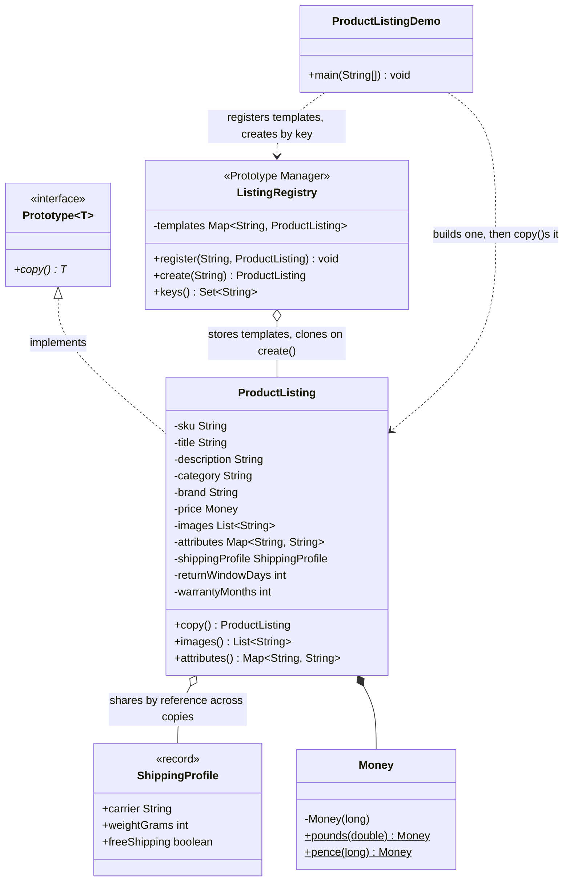

# Prototype Pattern — Class Diagram

## The structure


<details>
<summary>Mermaid source</summary>



</details>

The arrow to notice is `ProductListing o-- ShippingProfile`, drawn as
aggregation rather than composition. Every other collection field
(`images`, `attributes`) is deep-copied on every `copy()`; `shippingProfile`
is the one field a copy shares, by reference, with the prototype it came
from — safe only because `ShippingProfile` is immutable.

## What the caller can see

<details>
<summary>Mermaid source</summary>

```mermaid
flowchart TB
    subgraph outside["Calling code"]
        caller["master.copy()<br/>then a few setters"]
        keyed["registry.create(\"earbuds-template\")"]
    end

    subgraph inside["com.jk.explore.prototype"]
        proto["Prototype&lt;T&gt;<br/><b>public interface</b><br/>one method: copy()"]
        listing["ProductListing<br/><b>public, mutable</b><br/>implements Prototype&lt;ProductListing&gt;"]
        registry["ListingRegistry<br/><b>public</b><br/>named shelf of templates"]
    end

    caller -->|"clones directly"| listing
    keyed --> registry
    registry -->|"looks up, then calls copy() for you"| listing
    listing -.->|"implements"| proto

    style proto fill:#dbeafe,stroke:#1d4ed8,stroke-width:2px
    style listing fill:#fef3c7,stroke:#b45309
    style registry fill:#f1f5f9,stroke:#475569
```

</details>

## Notes

- `ProductListing` is deliberately mutable — a prototype is a working
  draft you clone and then adjust, unlike `PurchaseOrder` in the
  builder-pattern project, which is assembled once and frozen.
- `ListingRegistry` never constructs a `ProductListing` itself. It only
  ever calls `copy()` on whatever was registered, which is what lets it
  stay ignorant of how any given template was originally assembled.
- Compare with
  [`../../builder-pattern/docs/class-diagram.md`](../../builder-pattern/docs/class-diagram.md).
  There, one sequence of chained calls produces one object from nothing.
  Here, one existing object produces another that starts out identical.
