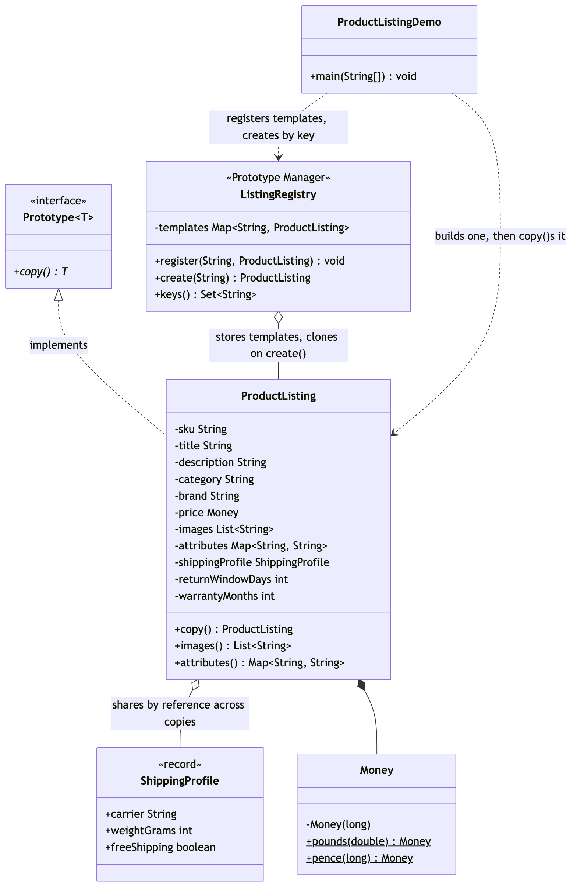
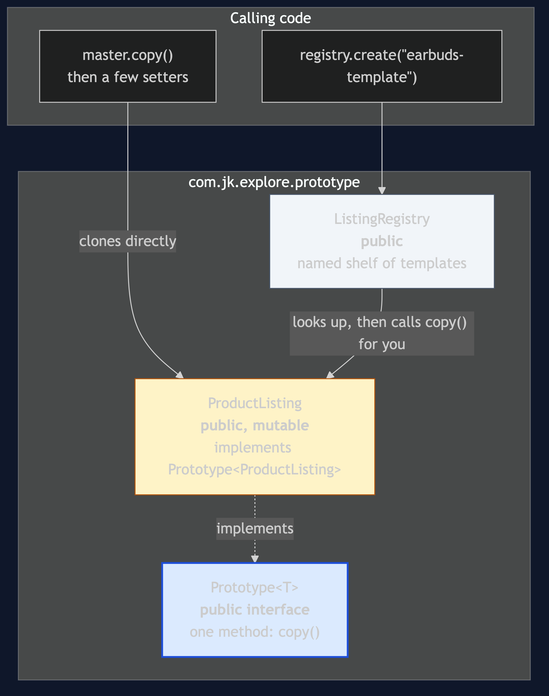

# Prototype Pattern — Class Diagram

## The structure

The arrow to notice is `ProductListing o-- ShippingProfile`, drawn as
aggregation rather than composition. Every other collection field
(`images`, `attributes`) is deep-copied on every `copy()`; `shippingProfile`
is the one field a copy shares, by reference, with the prototype it came
from — safe only because `ShippingProfile` is immutable.

## What the caller can see

## Notes

- `ProductListing` is deliberately mutable — a prototype is a working
  draft you clone and then adjust, unlike `PurchaseOrder` in the
  builder-pattern project, which is assembled once and frozen.
- `ListingRegistry` never constructs a `ProductListing` itself. It only
  ever calls `copy()` on whatever was registered, which is what lets it
  stay ignorant of how any given template was originally assembled.
- Compare with
  [`../../builder-pattern/docs/class-diagram.md`](../../builder-pattern/docs/class-diagram.md).
  There, one sequence of chained calls produces one object from nothing.
  Here, one existing object produces another that starts out identical.
