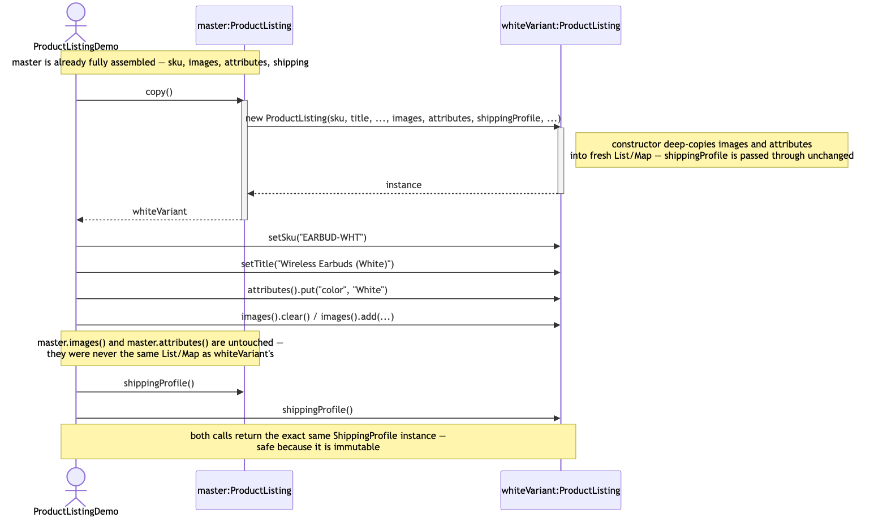
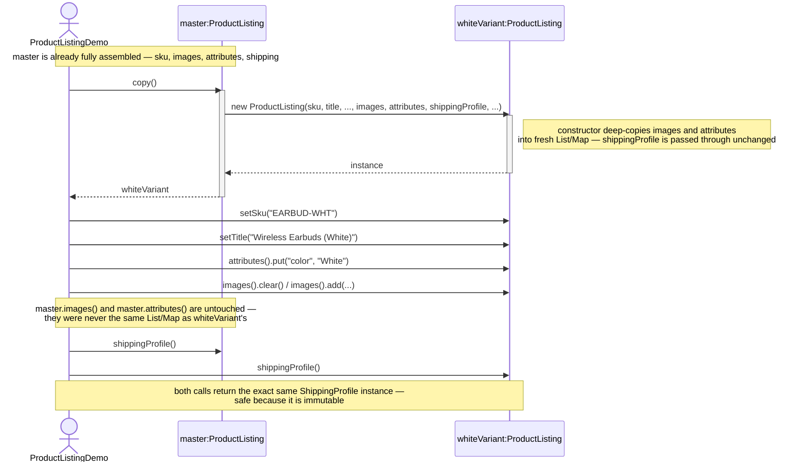

# Prototype Pattern — UML Sequence Diagram

Shows the runtime flow: an existing, fully-assembled listing produces an
independent copy, which is then tweaked without touching the original.

Mermaid source

## Notes

- The interesting work happens inside the `copy()` call, before it even
  returns — the constructor it delegates to is what decides, field by
  field, whether to deep-copy or share.
- Every mutation the client makes happens *after* `copy()` returns, on the
  copy alone. `master` is never touched again once it exists.
- Compare with
  [`../../builder-pattern/docs/uml-diagram.md`](../../builder-pattern/docs/uml-diagram.md).
  There, several small calls accumulate state before a final `build()`
  produces the first and only instance. Here, one call produces a second,
  independent instance from state that already existed.
