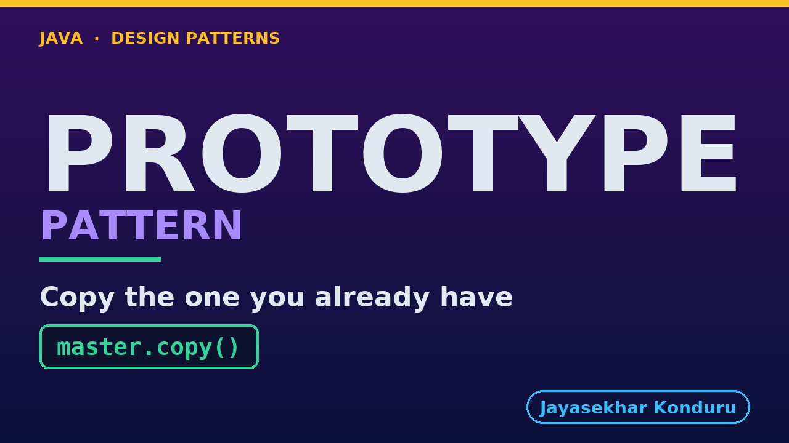

# YouTube — Prototype Pattern

Everything needed to publish `video/prototype-pattern-explained.mp4`. Copy the fields straight out of this file.

Chapter timings are generated from the video's `.srt`. Re-run `python3 docs/make_youtube_docs.py prototype` after any change to the narration, or they will be wrong.

## Title

```
Prototype Pattern in Java - Cloning Product Listings
```

52 characters — under the 60 YouTube shows before truncating in search results.

## Description

The first two lines are what a viewer sees above the fold, so they carry the hook rather than the boilerplate.

```
Learn the prototype pattern in Java 21 — a Gang of Four creational pattern for cheaply producing near-duplicates of an object that was expensive to assemble correctly. We start from a marketplace listing built twice with eight repeated arguments, look at why Java's own `Cloneable` disappoints (Effective Java, item thirteen), then build a plain `Prototype<T>` interface whose `copy()` reuses an existing defensive-copy constructor and makes a deliberate field-by-field choice: deep-copy what's mutable, share what's immutable. We finish with a prototype registry — the GoF's own named variant — for when the set of templates is decided at runtime. No prior design-pattern knowledge needed. Full source code and written notes are in the repository.

CHAPTERS
00:00 Introduction
00:54 The Job
01:30 The Repeated Eleven-Argument Call
02:04 The Cloneable Trap
02:41 Why That Hurts
03:13 The Prototype Pattern
03:40 A Photocopier, Not a Blueprint
04:14 The Shape of It
04:42 One Method, No Baggage
05:08 copy() Reuses the Constructor
05:37 Deep Copy vs. Shared Reference
06:08 Cloning and Tweaking
06:29 The Registry
06:59 Running It
07:28 Where It Stops
08:09 How It Relates to the Others
08:42 One Sentence to Keep
09:21 Thanks for Watching

SOURCE CODE, WRITTEN NOTES AND AN INTERACTIVE ANIMATION
https://github.com/jk-boot-up/java-design-patterns/tree/main/gradle-java/creational/prototype-pattern

WHAT YOU NEED FIRST
Java 21 and a working knowledge of classes and interfaces. No prior design-pattern knowledge is assumed. The full prerequisites are in docs/prerequisites.md in the repository.
```

## Chapters

YouTube renders these as chapters only if there are at least three and the first is at `00:00`.

```
00:00 Introduction
00:54 The Job
01:30 The Repeated Eleven-Argument Call
02:04 The Cloneable Trap
02:41 Why That Hurts
03:13 The Prototype Pattern
03:40 A Photocopier, Not a Blueprint
04:14 The Shape of It
04:42 One Method, No Baggage
05:08 copy() Reuses the Constructor
05:37 Deep Copy vs. Shared Reference
06:08 Cloning and Tweaking
06:29 The Registry
06:59 Running It
07:28 Where It Stops
08:09 How It Relates to the Others
08:42 One Sentence to Keep
09:21 Thanks for Watching
```

## Tags

```
prototype pattern, deep copy java, clone, design patterns, java design patterns, gang of four, java 21, software design, clean code, object oriented design, java tutorial, ecommerce, programming tutorial
```

203 characters, under YouTube's 500 limit.

## Thumbnail



**Upload `docs/thumbnail.png`** — 1280×720, the size YouTube recommends, generated by `docs/make_thumbnails.py`. It is deliberately not the same image as the video's opening frame: a thumbnail is judged at about 360 pixels wide in a search result, so this one carries only the pattern name, one line of promise and one short piece of code, each set large enough to survive the shrink.

`video/poster.png` is the 1920×1080 opening frame, produced by the video build. It stays in the repository as the title card; it is not what gets uploaded.

YouTube will not pick the thumbnail up on its own — upload it under **Details → Thumbnail → Upload file**. A custom thumbnail requires a verified channel.

## Upload checklist

- [ ] Upload `video/prototype-pattern-explained.mp4` (1080p, H.264, 30 fps, AAC 48 kHz — already YouTube's recommended settings, no re-encode needed)
- [ ] Set the video language to **English** first, or the subtitle option may not appear
- [ ] Add subtitles: *Video elements → Add subtitles → Upload file → With timing* → `video/prototype-pattern-explained.srt`
- [ ] Upload `docs/thumbnail.png` as the thumbnail — do not let YouTube auto-pick a frame
- [ ] Paste the title, description and tags from above
- [ ] Add to the **Java Design Patterns** playlist, in learning order
- [ ] Wait for 1080p processing before sharing the link — code slides are unreadable at 360p

## Cards and end screen

End screen links to **Singleton Pattern**, the next video in the learning order.

Add a card partway through pointing at the playlist, so a viewer who arrives at this pattern from search can find the rest of the series.

## Runtime

Approximately 09:47, narrated at 145 words per minute.
