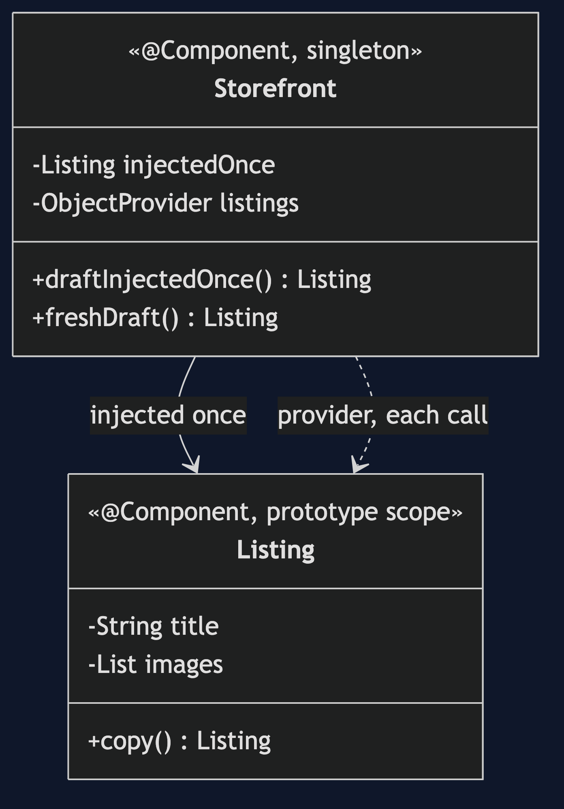
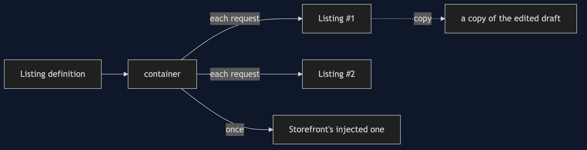

# Prototype with Spring Pattern

```
src/main/java/com/jk/explore/prototypespring/
├── ListingApplication.java    the Spring Boot entry point and the six acts
├── Listing.java               the prototype-scoped bean, with its own copy()
└── Storefront.java            a singleton that needs listings, two ways
```

**In Spring, prototype means a new bean from the definition every time. It is not a copy of a draft you edited.**

This project is the framework version of [Prototype](../prototype-pattern). That project built the mechanism by hand. This one shows the same idea inside Spring Boot. It does not re-teach the pattern. It shows what Spring Boot adds, the failures that are its own, and what it costs.

## Run

```bash
./gradlew run
```

Six acts. The partner project, Prototype, built the mechanism by hand. Here the same idea runs through Spring Boot, and every count comes from real output.

```
ONE. A new one each time.
  same object: false. both are titled 'Untitled'.
TWO. Independent.
  a: 'Blue Mug' with 2 images.
  b: 'Untitled' with 1 image.
THREE. A definition, not a draft.
  asked the container again: 'Untitled' with 1 image.
  asked the draft to copy(): 'Blue Mug' with 2 images.
FOUR. A prototype inside a singleton.
  two calls, same object: true.
  the second caller sees the first caller's title: 'Blue Mug'.
FIVE. Ask each time.
  two calls, same object: false.
  the second caller sees: 'Untitled'.
SIX. Nobody cleans up.
  listings built: 3. listings destroyed on close: 0.
  the singleton's destroy method ran 1 time on close.
  Spring builds a prototype and lets go of it. Cleaning up is the caller's job.
```

## Test

```bash
./gradlew test
```

2 test classes, 7 test methods, offline, with each Spring context started inside the test, and no server.

## Technologies and versions

| What | Version | Why it is here |
| --- | --- | --- |
| Java | 21 | The repository standard, via the Gradle toolchain block |
| Gradle | 9.2.1 | The wrapper in this directory; no separate install needed |
| Spring Boot | 4.1.1 | The container and its scopes |
| JUnit 5 | 5.10.2 | Test runner |

See [`docs/dependencies.md`](docs/dependencies.md).

## Learning Material

| Document | What it covers |
| --- | --- |
| [`docs/problem-statement.md`](docs/problem-statement.md) | The partner's listing, and what is new |
| [`docs/prototype-with-spring-pattern-explained.md`](docs/prototype-with-spring-pattern-explained.md) | A scope that builds from a definition |
| [`docs/class-diagram.md`](docs/class-diagram.md) | The types |
| [`docs/architecture-diagram.md`](docs/architecture-diagram.md) | A container, a singleton and a listing |
| [`docs/data-flow-diagram.md`](docs/data-flow-diagram.md) | Fresh from the definition, or copied from a draft |
| [`docs/sequence-diagram.md`](docs/sequence-diagram.md) | Written for a listener with the screen off |
| [`docs/uml-diagram.md`](docs/uml-diagram.md) | Four sequences |
| [`docs/animation.html`](docs/animation.html) | The six acts in a browser |
| [`docs/prerequisites.md`](docs/prerequisites.md) | What you need to know |
| [`docs/session.md`](docs/session.md) | A one-hour taught session |
| [`docs/spec.md`](docs/spec.md) | The generated specification |
| [`docs/youtube.md`](docs/youtube.md) | Title, description and chapters |
| [`docs/dependencies.md`](docs/dependencies.md) | What Spring Boot is, what it costs, and that skipping this project loses none of the pattern |

### The pattern in one picture



### Where each piece sits



### How one request moves


### Who calls whom, in order


### All four sequences


### Video

Built from [`video/scenes.py`](video/scenes.py) by
[`video/build_video.sh`](video/build_video.sh). The rendered file is not
committed; see the repository README for why.

## Where you have already met this

Per-request helpers, builders with state, and command objects. Any bean marked prototype.

## When this is too much

If the object is cheap and has no state to configure, `new` is simpler than a scope.

## Where this sits

This project pairs with [Prototype](../prototype-pattern), and is a framework version in [`creational`](..).
