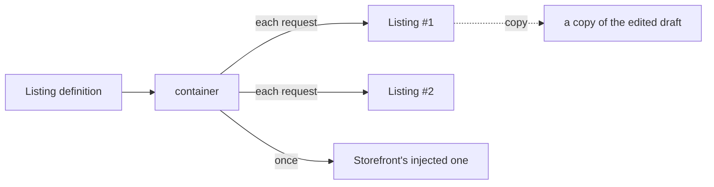

# Prototype with Spring Pattern — Architecture Diagram

The container builds a listing from its definition on each request.

Mermaid source

```mermaid
flowchart LR
    Def["Listing definition"] --> C["container"]
    C -->|each request| L1["Listing #1"]
    C -->|each request| L2["Listing #2"]
    C -->|once| S["Storefront's injected one"]
    L1 -.->|copy| L3["a copy of the edited draft"]
```

