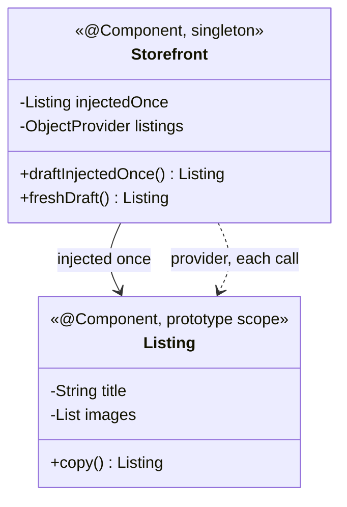

# Prototype with Spring Pattern — Class Diagram

`Listing` is prototype scope. `Storefront` is a singleton that takes it two ways.

Mermaid source

```mermaid
classDiagram
    class Listing {
        <<@Component, prototype scope>>
        -String title
        -List images
        +copy() Listing
    }
    class Storefront {
        <<@Component, singleton>>
        -Listing injectedOnce
        -ObjectProvider listings
        +draftInjectedOnce() Listing
        +freshDraft() Listing
    }
    Storefront --> Listing : injected once
    Storefront ..> Listing : provider, each call
```

