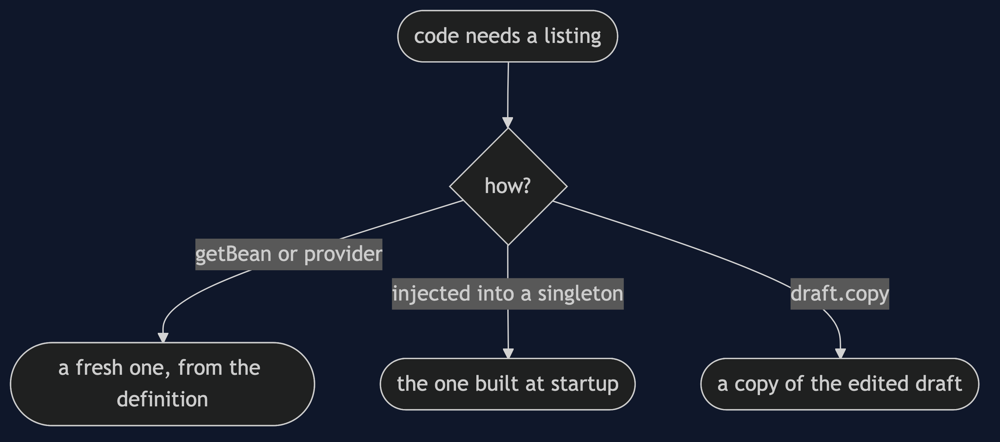
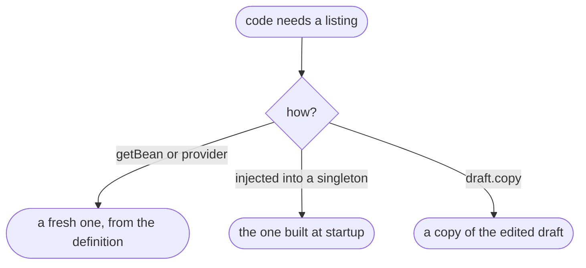

# Prototype with Spring Pattern — Data Flow Diagram

Where a listing comes from.

Mermaid source

```mermaid
flowchart TD
    Need(["code needs a listing"])
    How{"how?"}
    Fresh(["a fresh one, from the definition"])
    Same(["the one built at startup"])
    Draft(["a copy of the edited draft"])
    Need --> How
    How -- getBean or provider --> Fresh
    How -- injected into a singleton --> Same
    How -- draft.copy --> Draft
```

