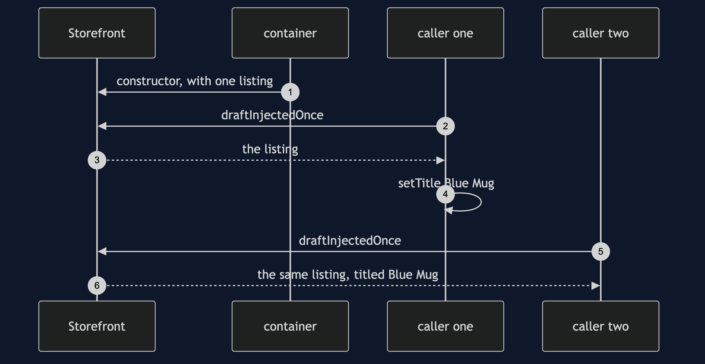
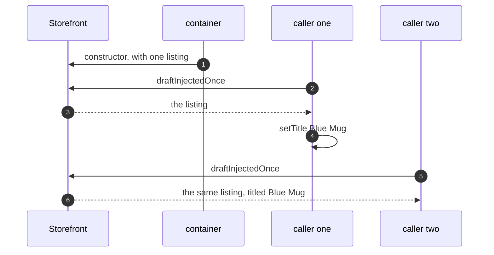

# Prototype with Spring Pattern — Sequence Diagram

Written for a listener with the screen off.

Say it in words. A singleton storefront is built. Its constructor asks the container for a listing, and gets one. The constructor never runs again. Caller one asks for a draft and gets that listing, and sets its title. Caller two asks for a draft and gets the very same listing, with caller one's title already on it.

Mermaid source

The load-bearing sentence: **a prototype injected into a singleton stops being a prototype.**
