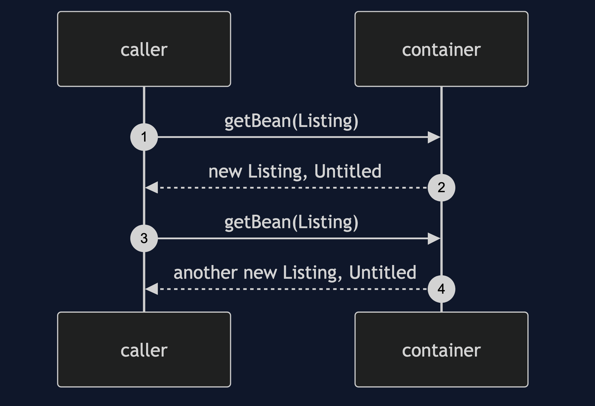
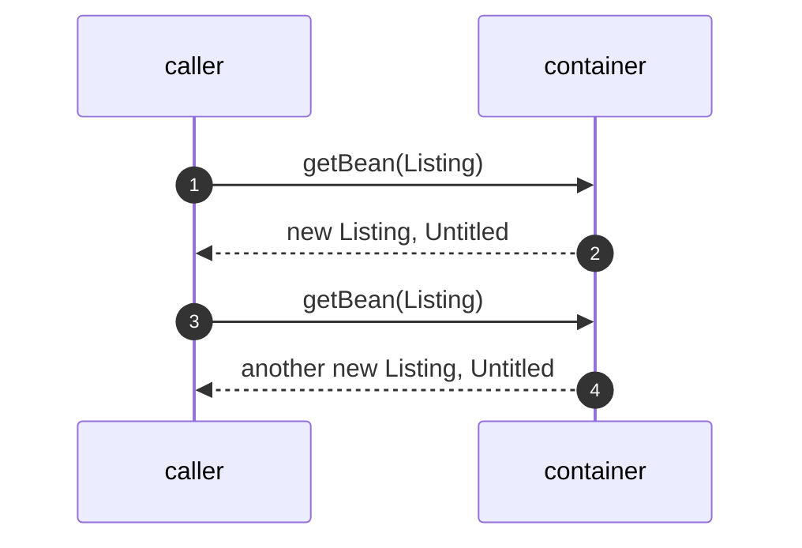
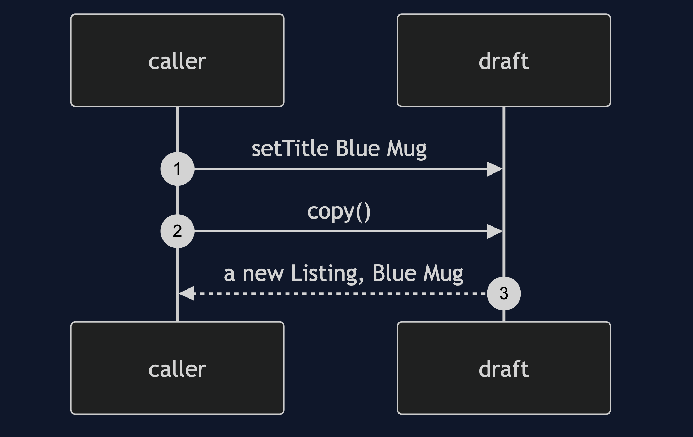
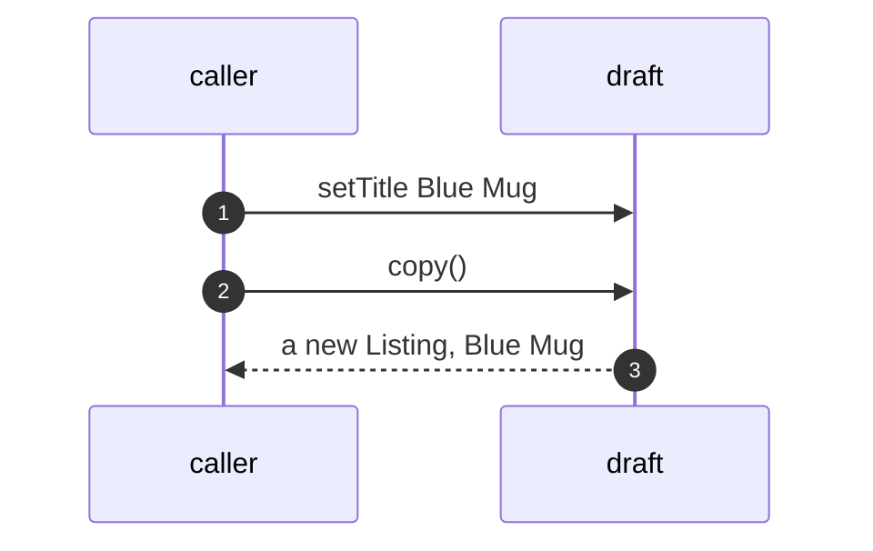
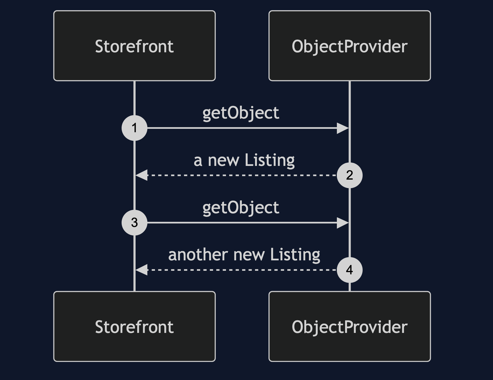
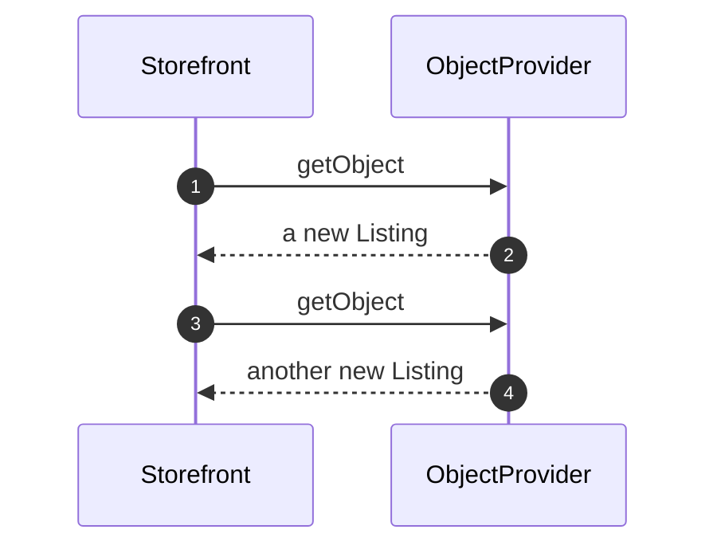

# Prototype with Spring Pattern — UML Sequence Diagrams

Four sequences.

## 1. Fresh From The Definition

Mermaid source

## 2. A Copy Of An Edited Draft

Mermaid source

## 3. Asking Through A Provider

Mermaid source

